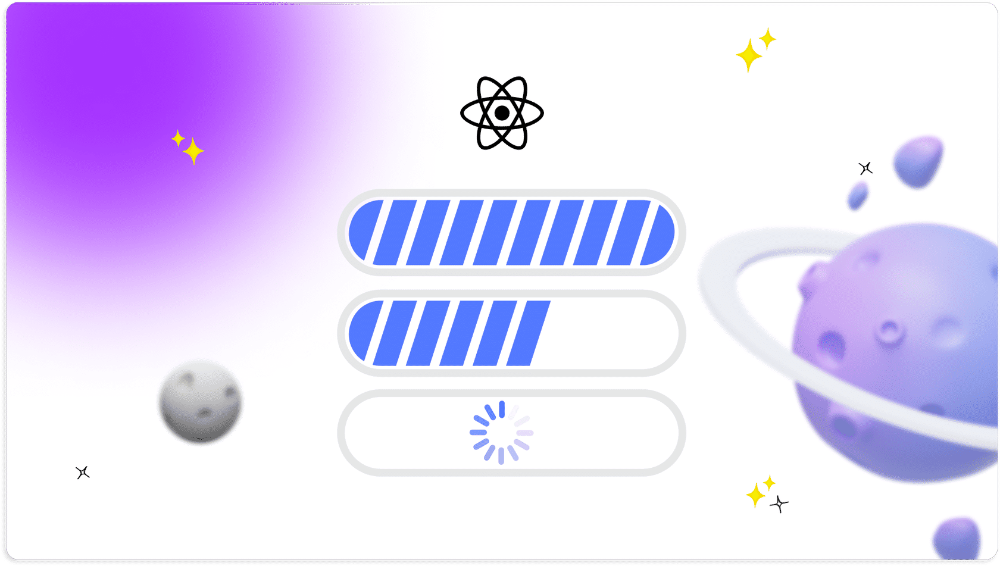
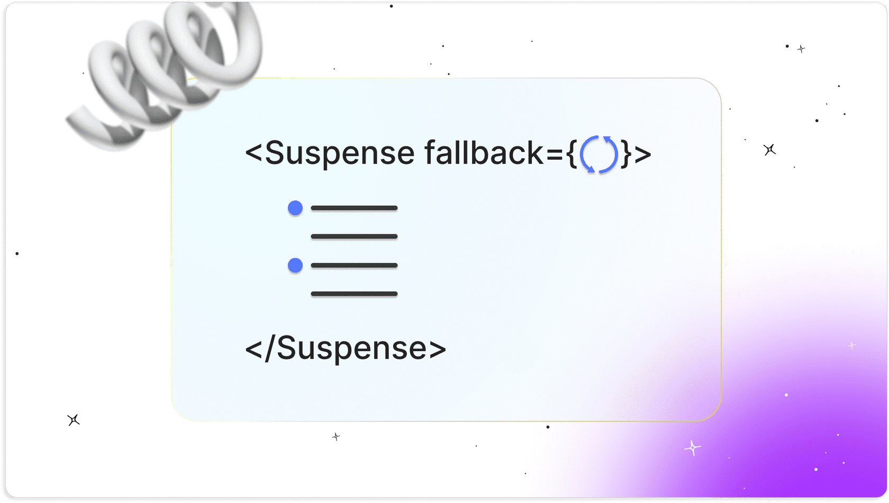
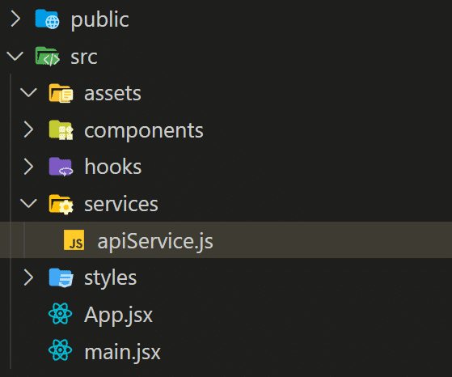
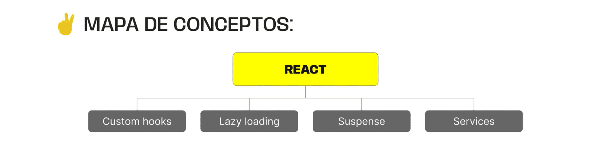

> # ***Modulo 3 - Clase 13: Frontend Avanzado***

> ## ***Objetivos***

* ### *Aprender qué son los custom hooks.*

* ### *Conocer qué son y cómo funcionan el Lazy Loading y Suspense.*

* ### *Mejorar la modularización de una aplicación por medio de la implementación de servicios.*

> ## ***Custom hooks***

* ### **Personalización de hooks**

  Los hooks son funciones que nos permiten desarrollar tareas específicas dentro del código. Estos nos sirven para manipular estados, realizar enrutamientos o gestionar efectos en los componentes.

  Los custom hooks encapsulan la lógica de tareas específicas para facilitar su reutilización en diferentes partes del código. Por convención, se crean utilizando el prefijo “use” seguido de un nombre descriptivo que indique su funcionalidad.

  ```javascript xml
  function useMyCustomedHook() {
    // lógica del hook
  }
  
  export default useMyCustomedHook;
  ```

* ### **Casos de uso**

  * #### **Realizar solicitudes HTTP.**

  * #### **Verificar el status de una conexión de red.**

  * #### **Autenticar usuarios.**

  * #### **Gestionar formularios.**

  ```javascript xml
  import { useState } from "react";

  export const useToggle = (initialValue = false) => {
    const [value, setValue] = useState(initialValue);
  
    const toggle = () => setValue(!value);
  
    return [value, toggle];
  };
  ```

  ```javascript xml
  import { useToggle } from "../hooks/useToggle";

  function  MyComponent() {
    const [isLogged, toggleHandler] = useToggle(false);

    return (
      <div className="nav-container">
        <div className="buttons">
          <button onClick={toggleHandler}>{isLogged ? "Logout" : "Login"}</button>
        </div>
        <UserPortrait status={isLogged} />
      </div>
    );
  }

  export default Navbar;
  ```

  ```javascript xml
  import { useState, useEffect } from "react";

  export const useFetch = (url) => {
    const [data, setData] = useState(null);
    const [error, setError] = useState(null);

    useEffect(() => {
      const fetchData = async () => {
        try {
          const response = await fetch(url);
          const data = await response.json();

          if (!response.ok) {
            throw new Error(`Request failed with status code ${response.status}`);
          }

          setData(data);
        } catch (error) {
          setError(error);
        }
      };

      fetchData();
    }, [url]);

    return {
      data,
      error,
    };
  };
  ```

  ```javascript xml
  import { useFetch } from "./hooks/useFetch";
  import Navbar from "./components/Navbar";

  function App() {
    const { data, error } = useFetch("https://jsonplaceholder.typicode.com/users");

    return (
      <div className="app-container">
        <Navbar />

        {
          error ? (
            <p>{error}</p>
          ) : (
            <ul>
              {data?.map((user) => (
                <li key={user.id}>{user.name}</li>
              ))}
            </ul>
          )
        }
      </div>
    );
  }

  export default App;
  ```

> ## ***Lazy loading & Suspense***

* ### **Características**

  Lazy Loading y Suspense son características introducidas en react para permitir la carga diferida (lazy loading) de componentes y la gestión de la espera (suspense) mientras se cargan los recursos asíncronos. El uso de ambos nos permite mejorar significativamente el rendimiento de la aplicación, así como la experiencia de usuario.

  * #### **REACT.LAZY**

    Lazy Loading es una técnica que consiste en cargar recursos solo cuando son necesarios, en lugar de cargar todo al iniciar una aplicación. Esto ayuda considerablemente al rendimiento de nuestras aplicaciones.

    Se utiliza especialmente en proyectos grandes con muchos recursos, reduciendo el tiempo de carga de la página. En el contexto de react, React.lazy nos permite importar componentes de forma diferida. Esto significa que el componente se carga solo cuando se necesita, disminuyendo el tamaño del paquete inicial descargado por el navegador.

    

  * #### **SUSPENSE**

    Suspense maneja la carga asíncrona de recursos.

    Brinda indicadores visuales durante la obtención de datos para mejorar la experiencia del usuario. Además, proporciona retroalimentación visual sobre el progreso y reduce la sensación de espera.

    Dentro de react, Suspense es un componente que envuelve a aquellos que se cargan de forma diferida y muestra un componente mientras se cargan los recursos asíncronos.

    

  ```javascript xml
  import useFetch from "./hooks/useFetch";
  
  const LazyDataLoader = () => {
    const { data, error } = useFetch(
      "https://jsonplaceholder.typicode.com/users"
    );

    return (
      <div>
        {error ? (
          <p}>{error}</p>
        ) : (
          <ul>
            {data?.map((user) => (
              <li key={user.id}>
                {user.name}
              </li>
            ))}
          </ul>
        )}
      </div>
    );
  };

  export default LazyDataLoader;
  ```

  ```javascript xml
  import React, { Suspense } from "react";
  import Navbar from "./components/Navbar";

  const LazyDataLoader = React.lazy(() => import("./components/LazyDataLoader"));

  function App() {
    return (
      <div className="app-container">
        <Navbar />
        <Suspense fallback={<div>Loading...</div>}>
          <LazyDataLoader />
        </Suspense>
      </div>
    );
  }

  export default App;
  ```

> ## ***Implementación de servicios***

* ### **Implementación de servicios**

  La implementación de servicios se refiere al uso de módulos o clases para manejar la lógica relacionada a la comunicación con agentes externos, como APIs , bases de datos, servicios en la nube, etc.

  

  ```javascript xml
  const API_URL = "https://jsonplaceholder.typicode.com";

  export const apiService = axios.create({
    baseURL: API_URL,
  });

  export const getUsers = async () => {
    try {
      const response = await apiService.get("/users");
      return response;
    } catch (error) {
      throw new Error(`Error fetching users: ${error.message}`);
    }
  };

  export const getUser = async (id) => {};

  export const createUser = async (user) => {};
  ```
***

> ## ***Cierre***

* ### **En conclusión...**

  * ***Gracias a los Custom Hooks:*** Aprendimos a encapsular y reutilizar lógica compleja de manera sencilla, permitiéndonos separar preocupaciones.

  * ***Mediante el Lazy Loading y Suspense:*** Descubrimos cómo optimizar el rendimiento de nuestras aplicaciones al cargar componentes de forma diferida y mostrar indicadores de carga mientras llegan los recursos asíncronos.

  * ***Mediante la implementación de Servicios:*** Aprendimos a abstraer la lógica de comunicación con servicios externos, promoviendo una mejor organización del código y facilitando su mantenimiento y modularización.

  
***