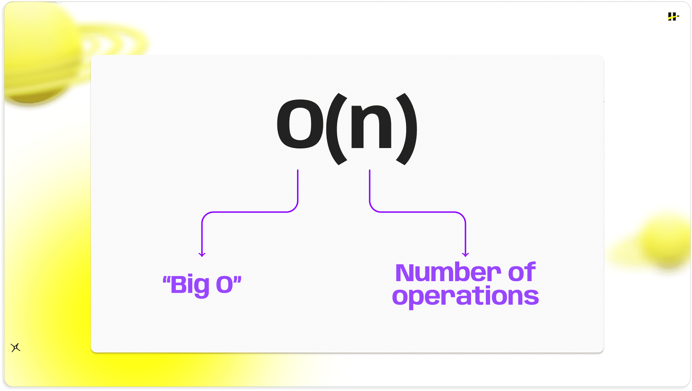
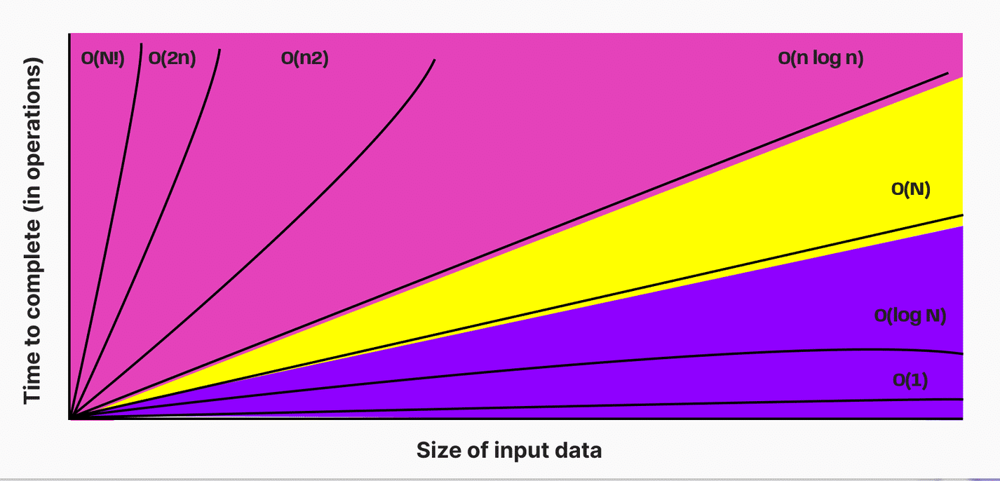
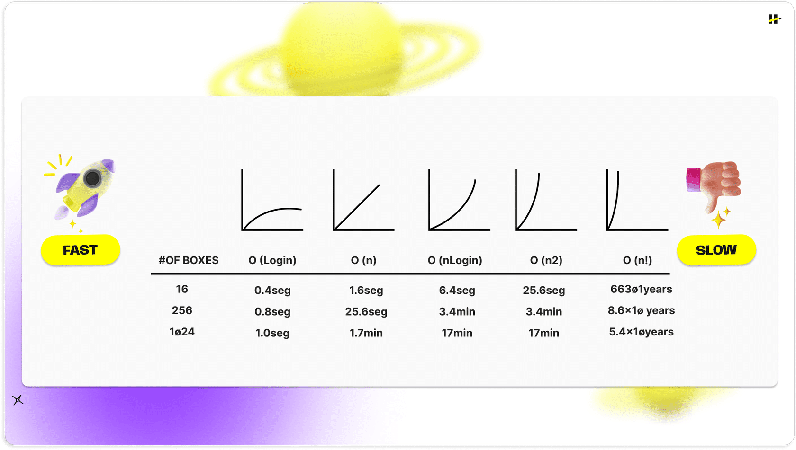
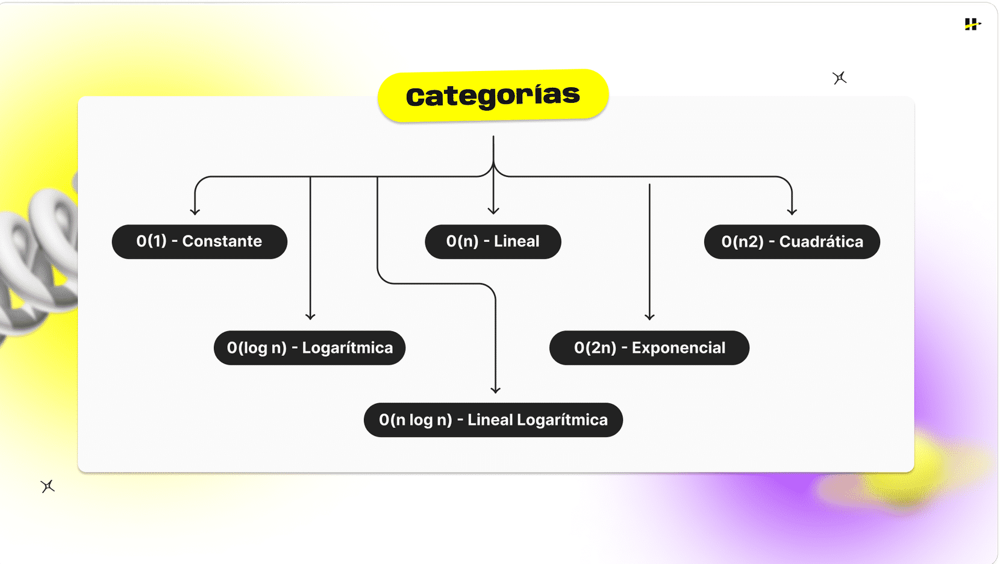
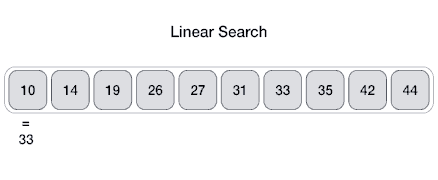
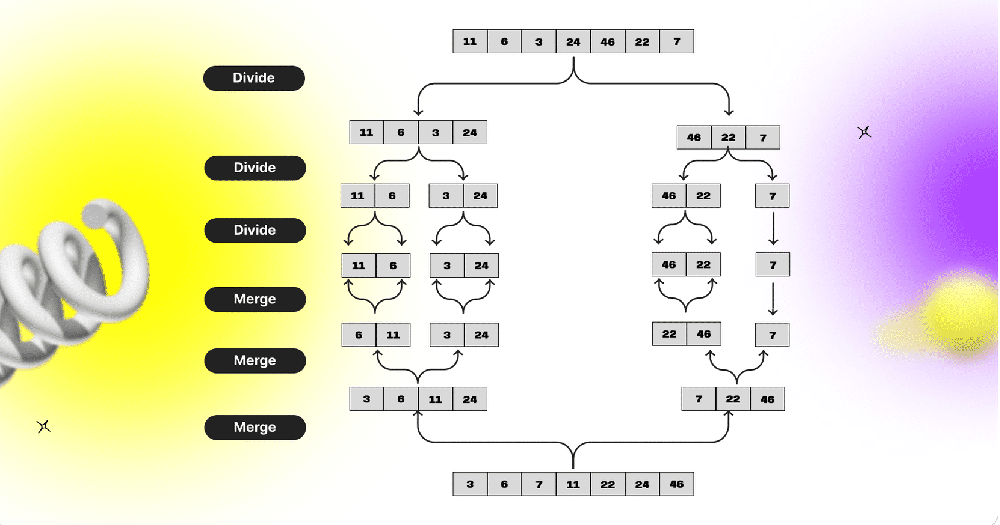
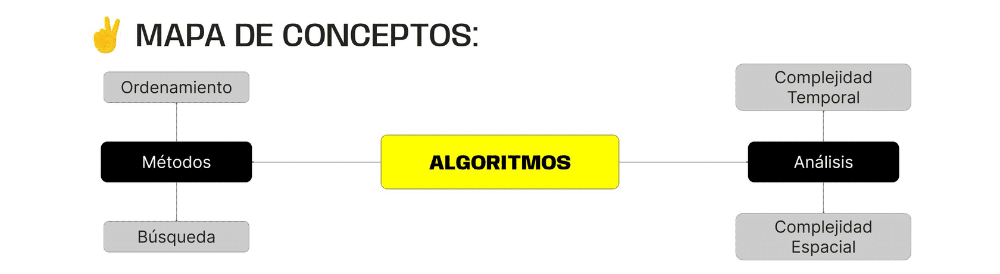

> # ***Modulo 3 - Clase 14: JavaScript Advanced II***

> ## ***Objetivos***

* ### *Aprender qué es la eficiencia y la complejidad de un algoritmo.*

* ### *Conocer e implementar algoritmos para comparar su complejidad.*

* ### *Utilizar la inteligencia artificial para mejorar la eficiencia de un código.*

> ## ***Time & Space complexity***

* ### **Eficiencia en programación**

  La eficiencia es la capacidad de que algo genere el efecto deseado con el mínimo esfuerzo posible.

  Las métricas para identificar código eficiente se encuentran bien definidas y evalúan principalmente los siguientes recursos:

  1. **Complejidad Temporal:** Representa la cantidad de tiempo que requiere un programa para ejecutarse en función del tamaño de su entrada. Este se mide normalmente en unidades de tiempo como segundos, milisegundos, etc.

  2. **Complejidad espacial:** Cantidad adicional de memoria que utiliza un programa mientras se ejecuta (incluyendo la memoria asignada para variables, estructuras de datos, pilas de llamadas, entre otros) en función del tamaño de la entrada.

> ## ***Algoritmos***

* ### **¿Qué es un algoritmo?**

  Se entiende por algoritmo a una secuencia ordenada y finita de pasos que permiten realizar una actividad o tarea. Dichos pasos deben ser sucesivos y exactos.

  Un algoritmo debe ser preciso, claro y no ambiguo, de manera que cualquier persona que siga los pasos correctamente pueda obtener el resultado deseado. No sirve de nada tener un algoritmo muy eficiente, pero que sea extremadamente complejo.

  La eficiencia de un algoritmo se mide mediante su complejidad algorítmica, evaluando el tiempo y espacio necesarios en función del tamaño de la entrada. Esta complejidad, a su vez, se expresa comúnmente con la notación Big O, que destaca la peor situación posible en relación con el tamaño de la entrada.

* ### **Big O' Notation**

  La notación Big O se emplea en el análisis de algoritmos para comparar su rendimiento a medida que el tamaño de la entrada crece. Se expresa como "O(f(n))", donde "f(n)" describe la máxima cantidad de recursos necesarios en función del tamaño de la entrada "n". Esta función representa típicamente el peor caso en términos de tiempo o espacio del algoritmo.

  

  Los algoritmos suelen clasificarse según la notación Big'O que representa su complejidad algorítmica.

  

  Cuanto menor sea la complejidad en términos de la notación Big O más eficiente será el algoritmo en términos de tiempo y/o espacio.

  

  Los valores de “# of boxes” representan la cantidad de datos de entrada. Debajo de cada función, estará el tiempo aproximado en segundos, minutos, días o años, que tardará el algoritmo en completarse, según su complejidad.

  Es evidente que entre mayor sea la cantidad de datos de entrada, más tiempo tomará en completarse. Igualmente, entre mayor complejidad, más tiempo tardará en terminar.

  

  * #### **O(1) - Constante**

    Este tipo de complejidad significa que el tiempo de ejecución (o espacio en memoria) del algoritmo, no depende del tamaño de la entrada.

  * #### **O(log n) - Logarítmica**

    A medida que el tamaño de la entrada aumenta, el tiempo (o espacio) necesario para completar la ejecución crece de manera proporcional al logaritmo del tamaño de la entrada.

  * #### **O(n log n) - Lineal logarítmica**

    La complejidad crece en proporción al producto del tamaño de la entrada y el logaritmo del tamaño de la entrada.

  * #### **O(n) - Lineal**

    A medida que la entrada aumenta, el tiempo (o espacio) necesario para completar la ejecución también aumenta de manera proporcional.

  * #### **O(2^n) - Exponencial**

    A medida que la entrada aumenta, el tiempo (o espacio) necesario para completar la ejecución aumenta exponencialmente.

  * #### **O(n^2) - Cuadrática**

    A medida que la entrada aumenta, el tiempo (o espacio) necesario para completar la ejecución aumenta al cuadrado del tamaño de la entrada.

* ### **Algoritmos en código**

  Si pensamos en una función para imprimir en pantalla el primer elemento de un array, podríamos pensar en una complejidad constante O(1), ya que en este caso el tamaño de dicho array sería totalmente indiferente.

  ```javascript
  const food = ["🍿", "🍔", "🍩", "🍗"];

  function printFirstElement(array) {
    console.log(array[0]);
  }

  printFirstElement(food);
  ```

  Mientras que imprimir cada elemento de ese array podría ser considerado un algoritmo de complejidad lineal O(n), pues el tiempo es directamente proporcional a la cantidad de elementos del array.

  ```javascript
  const food = ['🍿', '🍔', '🍩', '🍗'];

  function printAllElements(food) {
    food.forEach((objectFood) => {
        console.log('Esta es tu orden', objectFood);
    });
  }

  printAllElements(food);
  ```

  Al comparar ambas funciones, veremos que el tiempo de ejecución aumenta ya que en el segundo caso debe recorrer el array entero. La eficiencia se verá afectada por el tamaño del array tal como mencionamos anteriormente.

> ## ***Algoritmos de búsqueda y ordenamiento***

* ### **Algoritmos de búsqueda**

  Los algoritmos de búsqueda son métodos sistemáticos que se utilizan para localizar un elemento particular dentro de un conjunto de datos, como estructuras de datos. A pesar de que su eficiencia y complejidad pueden variar, los algoritmos de búsqueda son fundamentales en la resolución de problemas relacionados con la recuperación de información.

  * #### **BÚSQUEDA LINEAL**

    Se recorrerá el array de principio a fin comparando cada elemento con el valor objetivo. En el peor de los casos, este valor coincide con el último elemento del array, haciendo que el tiempo de resolución sea proporcional al tamaño de dicho arreglo.

    

  * #### **BÚSQUEDA BINARIA**

    Este algoritmo consiste en encontrar el valor intermedio del array ordenado y compararlo con el valor objetivo. Si es igual, devolvemos el resultado y finalizamos el proceso. De lo contrario, tendremos dos casos posibles: que el valor objetivo sea mayor o menor al valor intermedio.  
    
    En ambos casos tendremos dos grupos de datos (mayores y menores al objetivo) y podremos desechar la mitad de los datos según corresponda. Repetiremos esta operación tomando el nuevo array de datos hasta encontrar el resultado.

    De esta manera lograremos reducir el espacio de búsqueda por la mitad en cada iteración dividiendo el array en dos partes y seleccionando la mitad que podría contener el valor objetivo. Esto permite mantener una eficiencia constante sin importar la posición del número dentro del array.

    

* ### **Algoritmos de ordenamiento**

  El ordenamiento de datos es una práctica frecuente en la programación. Esta puede ser abordada de múltiples maneras por medio de algoritmos con diferentes niveles de eficiencia.

  * #### **Bubble sort**

    Bubble Sort compara elementos de a pares y los ordena dentro de un array. Este proceso se repetirá hasta que los datos estén ordenados y no se realice ningún cambio durante un recorrido completo del arreglo. Aunque su eficiencia varía según el orden inicial de los elementos en el array, tiende a tener una complejidad cuadrática debido a la cantidad de recorridos que pueda llegar a ejecutar.

    ```javascript
    function bubbleSort(array) {
      let change = true;

      while (change) {
        change = false;

        for (let i = 0; i < array.length - 1; i++) {
          if (array[i] > array[i + 1]) {
            let aux = array[i];
            array[i] = array[i + 1];
            array[i + 1] = aux;
            change = true;
          }
        }
      }

      return array;
    }
    ```

    Es un algoritmo sencillo de implementar. Su problema es que, conforme aumenta la cantidad de elementos del array y se encuentran más desordenados, la cantidad de recorridos a realizar aumenta de forma cuadrática.

* ### **Merge sort**

  La filosofía de este algoritmos gira en torno al concepto de divide and conquer (divide y vencerás). Esto significa que la mejor aproximación es segmentar un problema en problemas más pequeños que sean más fáciles de resolver de manera independiente. Consta de tres etapas.

  1. **Divide:** Divide el array desordenado en dos sublistas de tamaño aproximadamente igual.

  2. **Ordena:** Ordena recursivamente cada sublista. Este paso se repite hasta que cada sublista tenga un solo elemento, lo que se considera que está ordenado.

  3. **Combina (Merge):** Combina las sublistas ordenadas para producir una lista única y ordenada.

  Si planteamos este algoritmo en código, el primer paso será recibir un array y fragmentarlo utilizando una función a la que nombraremos dividir.

  Este proceso se hará hasta obtener arrays cada uno con un solo elemento del conjunto original. Los arreglos serán unificados y ordenados de manera recursiva gracias a la función merge.

  

  ```javascript
  function mergeSort(array) {
    if (array.length <= 1) return array;

    let div = dividir(array);
    let left = div[0];
    let right = div[1];

    return merge(mergeSort(left), mergeSort(right));
  }

  function dividir(array) {
    let middle = Math.floor(array.length / 2);
    let left = array.slice(0, middle);
    let right = array.slice(middle, array.length);

    return [left, right];
  }

  function merge(left, right) {
    let array = [];
    while (left.length && right.length) {
        if (left[0] < right[0]) {
            array.push(left.shift());
        } else {
            array.push(right.shift());
        }
    }
    
    while (left.length) {
      array.push(left.shift())
    }

    while (right.length) {
      array.push(right.shift())
    }
    
    return array;
  }
  ```

  Debido a su enfoque recursivo y la división en sub-listas, merge sort tiene una complejidad temporal garantizada de O(n log n) en todos los casos. Es mucho más eficiente que el anterior para ordenar grandes conjuntos de datos. Sin embargo, su principal desventaja es que requiere espacio adicional para almacenar las sub-listas durante el proceso de fusión.
***

> ## ***Cierre***

* ### **En conclusión...**

  * ***Exploramos Conceptos Fundamentales de Algoritmos:*** Desde su significado formal hasta las consideraciones que debemos tener al implementarlos. Comprendimos la importancia de la complejidad temporal y espacial para determinar qué algoritmo puede considerarse mejor que otro en términos de recursos y eficiencia. 

  * ***Analizamos Algoritmos de Búsqueda y Ordenamiento:*** Donde visualizamos las distintas categorías según la complejidad algorítmica determinada por la notación Big O. 

  * ***Destacamos la Eficiencia Algorítmica:*** Como un criterio clave para evaluar y mejorar nuestros procesos. Además, logramos integrar a chatGPT como herramienta para determinar y mejorar la eficiencia de un algoritmo.

  
***