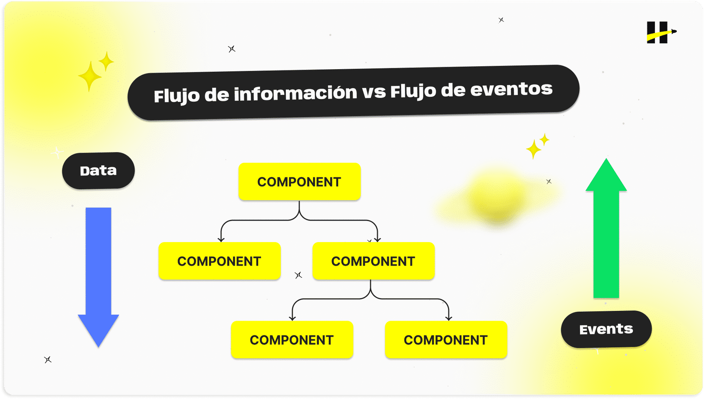
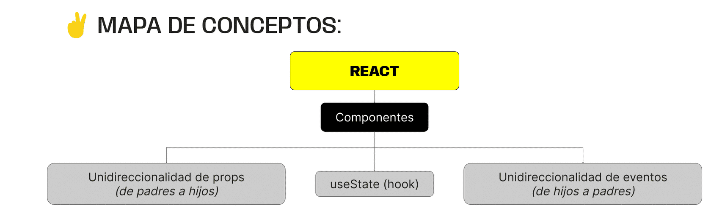

> # ***Modulo 3 - Clase 8: React Data Flow***

> ## ***Objetivos***

* ### *Entender el flujo de información en react.*

* ### *Aprender qué es y cómo generar un estado dentro de un componente.*

* ### *Comprender cómo se transmite la información entre componentes.*

* ### *Conocer el concepto de levantamiento de estado.*

> ## ***Flujo de datos***

* ### **Direccionalidad**

  El manejo de la información como un flujo unidireccional es uno de los principios en los que se centra react. Se refiere a que los datos, dentro de una aplicación, siguen un único orden al momento de ser transferidos entre componentes.

  Para aclarar mejor esta idea, diremos que un componente es un componente padre si este contiene y engloba a otro componente. Mientras que un componente hijo sería aquel que está contenido en un padre y es devuelto por él.

  

> ## ***Estados***

* ### **Estado de un componente**

  El estado de un componente se refiere a un objeto que permite almacenar y gestionar información, así como cambiar su apariencia y comportamiento a partir de la interacción de un usuario.

  Los estados nos permiten determinar cuándo renderizar (o actualizar) los componentes de nuestra página. Entonces, siempre que actualicemos el estado de un componente, el componente actualizará de forma inmediata su información.

* ### **Hooks**

  Los hooks son funciones especiales que permiten que un componente utilice características de react. Estos son siempre y únicamente empleados dentro de un componente.

  React cuenta con hooks predefinidos que poseen una funcionalidad específica según la necesidad de tu proyecto.

  * ***useContext***

  * ***useState***
  
  * ***useEffect*** 
  
  * ***useReducer*** 

  * ***useRef*** 
  
  * ***useMemo*** 

  * ***useCallback***

  Por convención entre programadores, se determinó que el nombre de un hook siempre iniciará con “use”, y luego una palabra representativa.

* ### **Casos de uso**

  Lo primero es importar el hook dentro del componente.

  Dentro del componente funcional, utilizamos el hook useState para declarar el estado. Este tomará un argumento (el valor inicial del estado) y devuelve un array con dos elementos: la variable de estado y una función para actualizar ese estado.

  Podemos utilizar la variable de estado (miEstado) en cualquier parte del componente donde se necesite acceder o mostrar el valor actual del estado.

  La función proporcionada por useState (setMiEstado) nos permitirá actualizar el valor del estado cuando sea necesario.

  **NO hay otra manera de cambiar el valor del estado si no es a través de esta función.**
  
  ```javascript xml
  import { useState } from "react";

  const MiComponente = () => {
    const [miEstado, setMiEstado] = useState(valorInicial);

    const handleClick = () => {
        // Actualiza el estado cuando se hace clic en un botón
        setMiEstado(nuevoValor);
    };

    return (
        <div>
            <p>Valor actual del estado: {miEstado}</p>
            <button onClick={handleClick}>Actualizar Estado</button>
        </div>
    );
  };
  ```

  #### **Casos comunes en los que se utiliza este hook...**

  * **Contado**

    ```javascript xml
    const [count, setCount] = useState(0);
    ```

  * **Entrada de usuario**

    ```javascript xml
    const [inputValue, setInputValue] = useState('');
    ```

  * **Control de visibilidad**

    ```javascript xml
    const [isVisible, setIsVisible] = useState(true);
    ```

  * **Datos de formulario**

    ```javascript xml
    const [formData, setFormData] = useState({ username: '', password: '' });
    ```

> ## ***Props***

* ### **¿Qué es?**

  La forma de transferir la información entre componentes es mediante el uso de propiedades (props). Estas propiedades son datos que guardaremos dentro de un objeto, y que lo pasaremos como un argumento al componente hijo.

  ```javascript xml
  // App.jsx
  function App() {

    return (
      <div> 
        <Card miProp={ prop1, prop2, prop3 }/>
      </div>
    )
  }

  // Card.jsx - Metodo 1
  const Card = (props) => {
    const { prop1, prop2, prop3 } = props.miProp

    return (
      <div>
          <p>{ prop1 }</p>
          <p>{ prop2 }</p>
          <p>{ prop3 }</p>
      </div>
    )
  }

  // Card.jsx - Metodo 2
  const Card = ({ miProp, ...otrosProps }) => {
    const { prop1, prop2, prop3 } = props.miProp

    return (
      <div>
          <p>{ prop1 }</p>
          <p>{ prop2 }</p>
          <p>{ prop3 }</p>
      </div>
    )
  }

  // Card.jsx - Metodo 3
  const Card = ({ miProp: { prop1, prop2, prop3 } }) => {

    return (
      <div>
          <p>{ prop1 }</p>
          <p>{ prop2 }</p>
          <p>{ prop3 }</p>
      </div>
    )
  }
  ```

> ## ***Lifting state up***

* ### **Información vs eventos**

  Cuando trabajamos con eventos en React estos se propagan en sentido inverso al flujo de la información. Es decir, se originan en componentes hijos y son manejados por funciones pasadas como props desde componentes padres.

* ### **Ejemplo Practico**

  Consideremos una app de tareas que nos permita contar el número total de tareas totales, listar las tareas  y agregar tareas a la lista.

  Haremos uso de tres componentes

  1. #### **ToDoCounter**

    ToDoCounter se encargará de renderizar simplemente la cantidad de tareas que hay en la lista, así que será un componente estático sin ninguna lógica específica.

    ```javascript xml
    const ToDoCounter = ({ todos }) => {
      return (
        <div>Total de tareas: { todos.length }</div>
      )
    };

    export default ToDoCounter;
    ```

  2. #### **ToDoList**

    ToDoList, tendrá un estado local como array que le permitirá almacenar tareas y renderizar cada una de estas como ítems de una lista desordenada.
    
    ```javascript xml
    const ToDoList = ({ todos }) => {

      return (
        <ul>
           {todos.map((tarea) => {
              return <li key={tarea}>{tarea}</li>
           })}
        </ul>
      );
    };
    ```

  3. #### **AddToDo** 

    AddToDo, se encargará de tomar el valor que se introduzca en el input el cual corresponde a la tarea a agregar.

    ```javascript xml
    const AddToDo = ({ setTodos }) => {
      function handleSubmit(event) {
        event.preventDefault();
        console.log(event.target.elements.todo.value);
      }

      return (
        <form onSubmit={handleSubmit}>
            <input type='text' id='todo' />
            <button type='submit'>Agregar tarea</button>
        </form>
      );
    };

    export default AddToDo;
    ```
    
  Es aquí donde debemos hacer uso del lifting state up. Dado que App es el componente padre de todos los demás, este será quien pueda gestionar y compartir la información a los componentes hijos.

  #### **Poniendo en acción todo lo visto hasta el momento, hagamos algunos cambios en el código:**

  1. El estado definido en ToDoList, será llevado a App, de manera que ToDoCounter reciba el array todos por props y simplemente se encargue de renderizar la longitud de este arreglo. De manera análoga, pasamos por props el estado todos a ToDoList, para que muestre la lista en el navegador.

  2. Finalmente, pasamos por props a AddToDo la función seteadora que modifica el estado todo en App, de manera que cada vez que se escriba algo en el input, tome su valor y lo agregue al array. 

  3. En este caso, la función setTodos usa una callback para que la renderización de la nueva tarea se haga de forma inmediata. Dicha callback tomará el estado anterior, hará una copia de sus elementos (tareas) y agregará al final a la nueva tarea proveniente del formulario.

  ```javascript xml
  import { useState } from 'react';
  import AddToDo from './AddToDo';
  import ToDoCounter from './ToDoCounter';
  import ToDoList from './ToDoList';
  import './App.css';

  function App() {
    const [todos, setTodos] = useState(['tarea 1', 'tarea 2', 'tarea 3']);
    return (
      <div>
        <AddToDo setTodos={setTodos} />
        <br />
        <ToDoCounter todos={todos} />
        <br />
        <ToDoList todos={todos} />
      </div>
    );
  }
  export default App;
  ```
***

> ## ***Cierre***

* ### **En conclusión...**

  * ***Aprendido el concepto de Flujo Unidireccional:*** De la información y cómo este define la estabilidad de una aplicación al momento de compartir datos entre componentes padres e hijos a través del objeto props.

  * ***Aprendimos qué es y cómo generar un Estado Interno:*** En un componente mediante el uso del hook useState, el cual nos concede el acceso a un objeto que podemos controlar para determinar cuándo react debe re-renderizar la información en pantalla. 

  * ***Descubrimos que aparte del Flujo de Información, está presente el Flujo de Eventos:*** Que ayuda a comunicar a los componentes hijos con sus padres a partir de la ocurrencia de eventos en la interfaz del usuario.

  * ***Introdujimos el concepto de Levantamiento de Estados:*** Que exhibe la información interna de un componente a partir de su estado local y compartirla con los demás componentes que la necesiten a través de su componente padre, las props y los eventos.

  