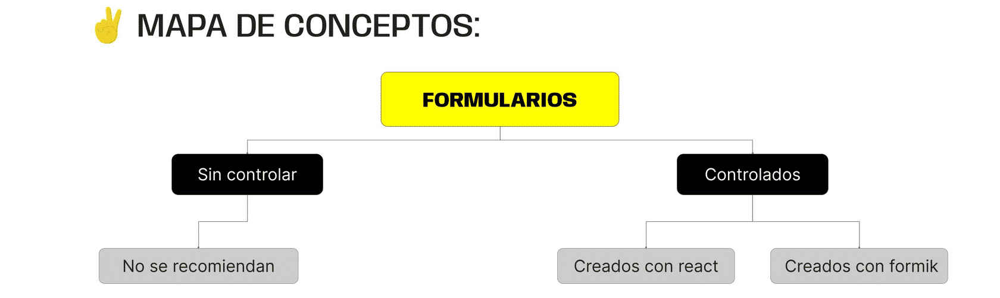

> # ***Modulo 3 - Clase 10: React Forms***

> ## ***Objetivos***

* ### *Aprender qué son y cómo construir un formulario.*

* ### *Entender qué son los formularios controlados.*

* ### *Comprender para qué y cómo validar un formulario controlado.*

* ### *Comparar el proceso de generación de formularios con Formik.*

> ## **Formularios**

* ### **Formularios**

  Los formularios son elementos muy importantes en las páginas web. Sirven como un puente entre un usuario y la base de datos. A través de los formularios podemos proporcionar información para que la aplicación pueda trabajar con ella.

  Algunos tipos de formularios son...

  1. **Formularios para registrarse o iniciar sesión.**

  2. **Creación de un nuevo producto en una página.**

  3. **Postulación a un puesto de trabajo.**

  4. **Publicación en una red social.**

* ### **¿Qué es?**

  Vamos a interpretar a los formularios como fragmentos de código que permiten a los usuarios enviar datos a un servidor para su procesamiento.

  Está compuesto por una serie de campos los cuales sirven como data-points para la recopilación de información.

  ```html
  <form id="miFormulario" method="post">
    <label for="nombre">Nombre:</label>
    <input type="text" id="nombre" required>

    <label for="email">Correo Electrónico:</label>
    <input type="email" id="email" required>

    <label for="mensaje">Mensaje:</label>
    <textarea id="mensaje" rows="4" required></textarea>

    <input type="submit" value="Enviar">
  </form>
  ```

  ```javascript xml
  function Form() {
    return (
      <form>
        <h2>LOGIN</h2>

        <div>
            <label>USERNAME</label>
            <input />
        </div>

        <div>
            <label>PASSWORD</label>
            <input />
        </div>

        <button>SUBMIT</button>
      </form>
    );
  }
  ```

> ## ***Formularios controlados***

* ### **¿Qué son?**

  El término formulario controlado se refiere a formularios donde los elementos de entrada están vinculados al estado del componente y son gestionados (controlados) por este. Esto nos permite centralizar la información, realizar validaciones y manejar eventos de forma precisa.

  ```javascript xml
  function Form() {
    const [userData, setUserData] = useState({
      username: "",
      password: "",
    });

    const handleInputChange = (event) => {
      const { name, value } = event.target;
      
      setUserData({
        ...userData,
        [name]: value
      });
    };

    const handleOnSubmit = (event) => {
      event.preventDefault();
      alert(`Username: ${userData.username} Password: ${userData.password}`);
    };

    return (
      <form>
        <h2>LOGIN</h2>

        <div>
            <label>USERNAME</label>
            <input required value={userData.username} onChange={handleInputChange}/>
        </div>

        <div>
            <label>PASSWORD</label>
            <input required value={userData.password} onChange={handleInputChange}/>
        </div>

        <button>SUBMIT</button>
      </form>
    );
  }
  ```

> ## ***Validación de datos***

* ### **Validación**

  La validación de datos nos permite garantizar que la información almacenada en una base de datos o utilizados en una aplicación sean precisos y consistentes, lo que evita errores en el funcionamiento del sistema. 

  Estas son una capa adicional de seguridad y evitan que datos incorrectos o no válidos lleguen al servidor, ahorrando recursos y evitando procesamientos innecesarios. Existen diferentes formas de validar un formulario.

* ### **Expresiones regulares**

  Las expresiones regulares (regex) son patrones de búsqueda que permiten encontrar y manipular cadenas de texto. Se utilizan para validar, buscar y manipular datos en texto de manera eficiente.

  ```javascript
  function esNumerico(str) {
    return /^\d+$/.test(str);
    // ... valida si lo ingresado es un número
  }

  console.log(esNumerico("12345")); // true
  console.log(esNumerico("12345abc")); // false
  ```

* ### **Validación de errores**

  Vamos a construir una función de JavaScript en la que validaremos si lo que recibimos es realmente un correo electrónico.

  Utilizaremos un condicional y el método test nativo del lenguaje. En caso de no cumplirse la validación agregará "error" al objeto de errores con el mensaje "username is invalid".

  Al escribir dentro del input de username veremos que la validación devuelve un objeto con error hasta el momento en que cumplimos con el patrón esperado.

  ```javascript
  function validar(input) {
    const errors = {};
    const emailRegex = /^[^\s@]+@[^\s@]+\.[^\s@]+$/;

    if (!emailRegex.test(input.username)) {
      errors.username = "username is invalid";
    }

    return errors;
  }
  ```
  
  Ahora solo resta controlar que, si hay errores, el usuario no pueda enviar la información del formulario. La forma más sencilla de hacerlo es generar una condición dentro de una función submitHandler() que evalúe el estado errores.

  ```javascript
  function submitHandler(event) {
    event.preventDefault();

    if(Object.keys(errors).length) {
        return alert("There are errors");
    }

    alert(`username: ${userData.username} password: ${userData.password}`);
  }
  ```

  Si el objeto errors contiene información, entonces no permite el envío. Caso contrario, puede enviar la data.

> ## ***[Formik](https://formik.org/docs/overview)***

* ### **¿Qué es?**

  Formik es una librería de código abierto enfocada en la creación de formularios que trabaja de forma declarativa simplificando el control de los valores y validación de inputs.

  ```bash
  npm i formik --save
  ```

* ### **React forms vs Formik**

  ```javascript xml
  import { Formik, Field, Form, ErrorMessage } from "formik";
  import { validar } from "./helpers";
  
  function FormikLogin() {
    return (
      <Formik
        initialValues={{ username: "", password: "" }}
        validate={validar}
        onSubmit={(values) =>
          alert(`username: ${values.username} password: ${values.password}`)
        }>
        <Form>
          <label>USERNAME</label>
          <Field type="text" name="username" placeholder="example@gmail.com" />
          <ErrorMessage name="username" />
  
          <label>PASSWORD</label>
          <Field type="password" name="password" placeholder="********" />
          <ErrorMessage name="password" />
  
          <button type="submit">SUBMIT</button>
        </Form>
      </Formik>
    );
  }
  ```

  1. **validar:** Función que hemos creado anteriormente para validar inputs.

  2. **Formik:** Este es un componente que se importa desde la librería y debe envolver a todo el formulario. Recibe 3 propiedades.

       * **InitialValues:** Es en donde diremos cuáles son los datos que queremos reunir en el formulario.

       * **Validate:** Le pasaremos nuestra función validadora.

       * **OnSubmit:** Es la función que se ejecutará cuando el formulario se envíe correctamente y no presente errores.

  3. **Form:** Dentro del componente form es en donde construiremos nuestro formulario.

  4. **Field & ErrorMessage:**

      * **Field:** El componente Field será el input per sé en el que el usuario ingresará sus datos.

      * **ErrorMessage:** El componente ErrorMessage es simplemente en donde aparecerá el mensaje de error en el caso de haber un problema con los datos ingresados.
***

> ## ***Cierre***

* ### **En conclusión...**

  * ***Comprendimos cómo el Manejo y Validación mediante Formularios Controlados:*** Nos brinda un mayor control sobre la información ingresada por un usuario. 

  * ***Adoptamos la Gestión del Estado del Formulario a través de React:*** Podemos crear aplicaciones que validen los campos de manera inmediata y avisen al usuario sobre posibles errores en la información suministrada.

  * ***Mencionamos a Formik:*** Una herramienta que simplifica significativamente la creación y validación de formularios. También mejora la legibilidad y el mantenimiento, permitiéndonos enfocarnos más en la lógica de la aplicación que en la gestión del estado del formulario de manera manual. 

  
***