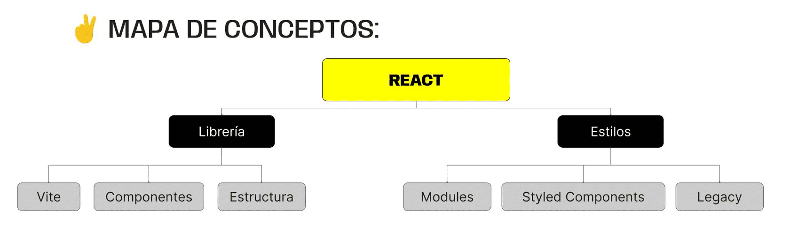

> # ***Modulo 3 - Clase 7: React Intro & Styles***

> ## ***Objetivos***

* ### *Entender qué es y cómo funciona react.*

* ### *Aprender a generar un proyecto de react con vite.*

* ### *Comprender qué son y cómo se construye un componente.*

* ### *Agregar estilos en un proyecto de react.*

> ## ***[React](https://react.dev/)***

* ### **¿De dónde viene react?**

  En el año 2013, Meta desarrolló una librería llamada React, para crear páginas web de una manera más ágil. Muchas aplicaciones, están desarrolladas en base a esta librería.
  
* ### **¿Qué es?**

  React es una librería desarrollada específicamente para la creación de interfaces de usuario utilizando pequeñas piezas independientes y reutilizables conocidas como componentes, que en conjunto dan forma a una aplicación web en su totalidad.

  Un componente es un bloque visual que define la presentación de una parte específica de una aplicación web.

> ## ***React + vite***

* ### **Vite**

  Para trabajar con react es necesario instalar la librería, en la documentación se nos alienta a utilizar alguna herramienta externa que nos permita construir una base optimizada de un proyecto con una pre-configuración.

  Por el momento vamos a utilizar uno llamado Vite, el cual nos facilitará el acceso y configuración de react.

* ### **¿Por qué Vite?**

  Las páginas web se han vuelto cada vez más complejas debido a la cantidad de información que contienen y a la exigencia de las interfaces de usuario, lo cual conlleva a tener una mayor cantidad de módulos que deben ser unificados para poder trabajar en conjunto.

  Este proceso de unificación llamado bundle-build consiste en consolidar y empaquetar varios archivos y recursos en un único paquete. Pero con el aumento en la complejidad de los proyectos fue perdiendo eficiencia en los tiempos de carga de las aplicaciones web.

  Vite permite desarrollar más rápido, dado que carga módulos sobre la marcha ya que carga lo que necesitas cuando lo necesitas, lo cual mejora el rendimiento y la experiencia de desarrollo.

  

> ## ***Componentes***

* ### **Estructura de un componente**

  Un componente de react es una función de JavaScript que devuelve elementos que representan la interfaz del usuario.

  ```javascript xml
  function MyComponent () {
    let contador = 0
    
    return <div>
                Hola, soy un componente funcional!
                <p>Mi contador: { contador }</p>
           </div>
  }

  export default MyComponent;
  ```

  

* ### **Renderizado**

  React se encarga de construir el DOM virtual utilizando los elementos que retorna cada componente y genera una versión del DOM real agregando los elementos definidos en nuestra app.

  ```javascript xml
  import Register from './Register'
  import Login from './Login'

  function App() {
    const isRegistered = true;

    return (
      <div> 
        <h1>Bienvenidos a mi primera app<h1>
        {isRegistered ? <Login /> : <Register />}
      </div>
    )
  }

  export default App
  ```

> ## ***Estilos***

* ### **Técnicas de estilo**

  Al trabajar con react existen diversas formas de agregar estilos a los componentes que dan forma a nuestra página.

  * #### CSS Legacy

    La forma clasica, creando un archivo index.css en el que definiremos clases para etiquetas, clases e Ids. Y para conectar estas clases con el componente que renderizara esos estilos, usaremos el atributo className

    ```css
    .title {
      color: green;
    }
    ```

    ```javascript xml
    function App() {
      return (
        <div> 
          <h1 className='title'>Bienvenidos a mi primera app<h1>
        </div>
      )
    }
    ```

  * #### CSS Modules

    Este metodo consiste en crear archvios ".module.css" que podran ser importados de manera global sin necesidad de exportarlos explicitamente. Estos se importaran como objetos javascript, donde los estilos son las propiedades del objeto.

    ```css
    /* App.module.css */

    .title {
      color: green;
    }

    .subtitle {
      color: aqua;
    }
    ``` 

    ```javascript xml
    import styles from "./App.module.css"

    function App() {
      return (
        <div> 
          <h1 className=`{styles.title}`>Bienvenidos a mi primera app<h1>
          <h2 className=`{styles.subtitle}`>Esta app es genial!<h2>
        </div>
      )
    }
    ```

  * #### Styled Components

    El tercer y ultimo metodo que veremos es a traves de una libreria externa.
    Esta consta de un objeto que en su interior contiene todas las etiquetas html y nosotros podemos estilarlos directamente en el mismo archivo encerrando los styles dentro de backsticks.

    ```bash
    npm install styled-components
    ```

    ```javascript
    // customButton.js

    import syled from 'styled-components'

    export default customButton = styled.button`
        color: black;
        font-size: 1.5rem;
        margin: 1rem;
        padding: .25rem 1rem .25rem 1rem;

        &:hover {
          background-color: red;
        }
    `
    ```

    ```javascript xml
    import CustomButton from "./customButton.js"

    function App() {
      return (
        <div> 
          <h1 className=`{styles.title}`>Bienvenidos a mi primera app<h1>
          <CustomButton>Soy un boton estilado!</CustomButton>
        </div>
      )
    }
    ```
***

> ## ***Cierre***

* ### **En conclusión...**

  * ***Exploramos los Fundamentos de React:*** Comprendimos la importancia de los componentes como bloques de construcción modulares, que permiten organizar y reutilizar nuestro código.

  * ***Exploramos los Componentes Funcionales:*** Una forma concisa de definir nuestros elementos que harán parte de la interfaz del usuario. 

  * ***Experimentamos con Técnicas de Estilos:*** Desde enfoques tradicionales como CSS legacy hasta soluciones más modernas y modulares como los CSS Modules y Styled Components, todo esto contenido en el entorno de desarrollo Vite.

  
***