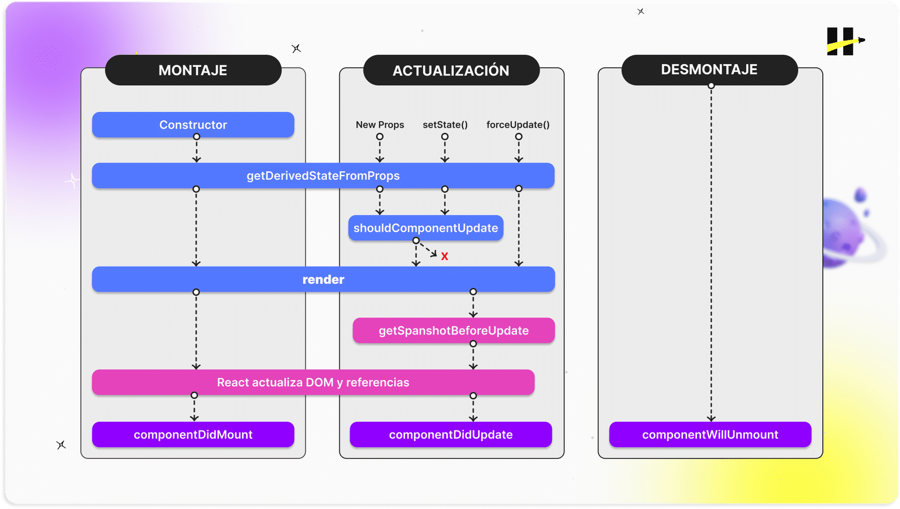
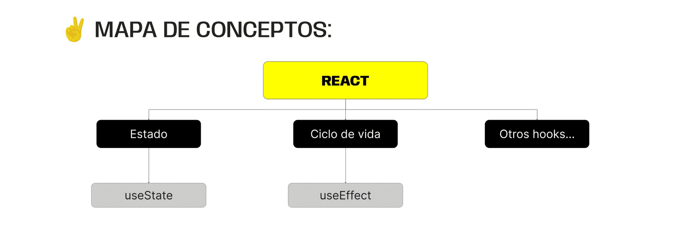

> # ***Modulo 3 - Clase 9: ReactLifeCycle***

> ## ***Objetivos***

* ### *Desarrollar qué es el ciclo de vida de un componente.*

* ### *Comprender las diferentes etapas del ciclo de vida.*

* ### *Aplicar de forma integradora los conocimientos en un mini proyecto.*

> ## ***Ciclo de vida***

* ### **Componentes y sus ciclos**

  El término ciclo de vida se refiere a las fases y métodos que ocurren desde que un componente comienza a renderizarse en pantalla hasta que desaparece. Estas fases permiten que los componentes realicen diferentes tareas.

* ### **Componentes de clase**

  Un componente de clase se extiende de una clase predefinida de react llamada Component.

  Al ser una clase y no una función no retorna ningún valor. Por lo que la forma de renderizar algo es utilizando el método render que también viene predefinido.

  ```javascript xml
  import React, { Component } from 'react';

  class Saludo extends Component {
    render() {
      return (
        <div>
            <h1>Hola, mundo!</h1>
        </div>
      );
    }
  }

  export default Saludo;
  ```

  Los componentes de clase pueden recibir props de un componente padre, así como contener un estado interno para almacenar y gestionar información.

  Este componente de clase recibe una prop llamada nombre. En el constructor se inicializa un objeto.

  En este tipo de componentes no se utilizan hooks, ya que son exclusivos de los componentes funcionales.

  El constructor recibe la prop e inicializa el estado con un mensaje personalizado que incluye el nombre.

  ```javascript xml
  import React, { Component } from 'react';

  class SaludoPersonalizado extends Component {
  constructor(props) {
    super(props);
    this.state = {mensaje: `Hola, ${this.props.nombre}!`};
  }

    render() {
      return (
        <div>
            <p>{this.state.mensaje}</p>
        </div>
      );
    }
  }

  export default SaludoPersonalizado;
  ```

* ### **Ciclos**

  

> ## ***useEffect***

* ### **Hook useEffect**

  El ciclo de vida en los componentes funcionales se trabaja de una manera muy distinta a cómo lo hacen los componentes de clase.

  Aquí se incorpora el concepto de efectos.

  Estos hacen referencia a acciones secundarias que pueden llevarse a cabo más allá de la propia renderización. De esta forma, se puede controlar en qué momento del ciclo queremos que estas acciones ocurran.

  Para gestionar estos efectos, react cuenta con un hook integrado llamado useEffect(), que se encarga de realizar efectos secundarios dentro de los componentes funcionales en las distintas etapas del ciclo de vida.

  El hook useEffect nos permitirá realizar acciones cuando un componente se monta, se actualiza o se desmonta.

* ### **Estructura**

  ```javascript xml
  import { useEffect } from 'react';
  
  // MONTAJE
  useEffect(() => {
    // Código
  });

  // ARREGLO DE DEPENDENCIAS
  useEffect(() => {
    // ...
  }, [/*Dependencias*/]);
  
  // DESMONTAJE
  useEffect(() => {
    return () => {/* Código */}
  });
  ```

* ### **Casos de uso**

  * #### **Montaje** 
  
    El hook useEffect recibe un primer parámetro que es una función callback. Aquí podrás definir aquel código que quieres que se ejecute cuando el componente se monta. Puede ser uno o más métodos.

    * Solicitud de datos desde una API o base de datos.

    * Realizar suscripciones a eventos del navegador.

    * Inicializar recursos externos como, por ejemplo, un reproductor de video.

  * #### **Actualización:** 
  
    El hook useEffect puede recibir un segundo parámetro: el arreglo de dependencias.  
    
    Dentro de este arreglo especificamos las variables que, cuando cambian, activan la ejecución del efecto asociado. Al declarar este arreglo vacío, indicamos al useEffect que dicho efecto solo ocurrirá luego del montaje. Es decir, se ejecutarán las acciones cuando queramos actualizar el montaje.

    * Realizar acciones cada vez que una prop específica cambie.

    * Actualizar el título de la página cada vez que el estado del componente se modifique.

    * Gestionar acciones cada vez que una sección específica del estado cambia, por ejemplo, cuando un usuario inicia sesión.

  * #### **Desmontaje** 
  
    Para poder ejecutar código cuando un componente se desmonta tendremos que retornar un callback dentro del primer callback que vimos en el punto de arriba. 
  
    Es este código retornado que se ejecutará cuando el componente se desmonte.

    * Limpiar suscripciones a eventos del navegador.

    * Limpiar el almacenamiento local del navegador.

    * Cancelar peticiones de red o APIs.
***

> ## ***Cierre***

* ### **En conclusión...**

  * ***Comprendimos el Ciclo de Vida de un Componente:*** Y cómo utilizar el hook useEffect es fundamental para desarrollar aplicaciones efectivas y con un rendimiento óptimo. El ciclo de vida proporciona puntos clave en el proceso de renderizado desde el montaje hasta su desmontaje de la interfaz.

  * ***Al emplear el ciclo de vida y el hook useEffect para los Efectos:*** Los desarrolladores tienen la capacidad de manejar situaciones diversas, como la inicialización de datos, la actualización dinámica en respuesta a cambios y la gestión adecuada de recursos para mantener una interfaz de usuario fluida y receptiva.

  
***