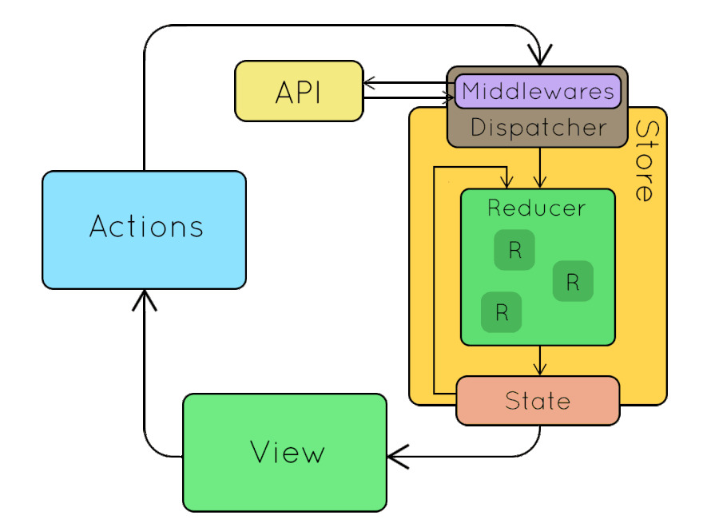

> # ***Modulo 3 - Clase 12: React Redux***

> ## ***Objetivos***

* ### *Aprender qué es redux.*

* ### *Entender los principios fundamentales de redux core.*

* ### *Conocer qué es redux toolkit.*

* ### *Integrar a redux en un proyecto.*

> ## ***Redux***

* ### **Estados | Globales vs Locales**

  Hasta ahora hemos trabajado con estados locales en los componentes y compartiendo información por medio de props. Esta forma de manejar información es útil cuando una aplicación es sencilla y la información almacenada es usada solo por algunos componentes.

  

  Sin embargo, pensemos en una aplicación donde la información es utilizada en una gran cantidad de componentes diferentes, los cuales en ocasiones no están siquiera relacionados.

  

  Por esto es importante tener una herramienta que nos permita facilitar la gestión de la información a un nivel global. De esta forma podremos acceder a la información desde cualquier parte de la aplicación.

* ### **¿Qué es redux?**

  Redux es una librería independiente de react que fue diseñada para manejar de manera sencilla el estado global de una aplicación.

  El objetivo general de redux es proporcionar un almacén centralizado para el estado de la aplicación y facilitar el manejo y sincronización de los datos entre las distintas partes que lo consumen.

* ### **Los 3 principios de redux**

  #### En Redux, todo gira en torno a tres principios fundamentales: 

  1. **Fuente única de la verdad:** Todo lo que necesitas saber sobre la aplicación se encuentra en un solo lugar, denominado store, que facilita la gestión y comprensión del estado general.

  2. **El estado es de solo lectura:** Solo puedes cambiar el estado emitiendo las llamadas actions, lo que hace que las modificaciones sean predecibles y rastreables. Los estados son considerados inmutables ya que no pueden ser modificados directamente después de ser creados.

  3. **Los cambios son realizados mediante funciones puras:** Las transformaciones del estado son manejadas por funciones predecibles y sin efectos secundarios, conocidas como reducers.

* ### **Flujo de información**

  1. #### **Cuando pedimos un cambio en un componente, como hacer clic en un botón, la información se usa para crear una ACTION.** 

  2. #### **Esta ACTION luego se envía al STORE, para ser pasada junto con el estado global actual al REDUCER.**

  3. #### **En esencia, este último decidirá si el cambio solicitado puede realizarse o no.** 

  4. #### **Si es así, modifica el estado global con la información de la ACTION y devuelve el nuevo estado que refleja los cambios en el componente.**

  

> ## ***Redux Core***

El Redux Core corresponde a los conceptos y funciones fundamentales que componen la librería de redux. Estos son...

* ### **Actions & action creators**

  Una action es en esencia un objeto que contiene información sobre el cambio solicitado por un componente de la aplicación.

  Este objeto comprende, a lo sumo, dos propiedades básicas:

  * **Action type:** indica el tipo de acción a efectuarse. Actúa como una clave que será utilizada por el reducer para determinar qué cambio realizar.

  * **Action payload:** contiene la información necesaria enviada por el componente para modificar el estado. esta información es opcional dependiendo de la acción a realizar.

  ```javascript
  export const depositMoney = (count) => {
    return {
      type: 'ADD_TODO',
      payload: 'SEND_INFORMATION',
    };
  };
  ```

* ### **Reducer**

  El reducer es una función pura que toma dos argumentos: el estado, (por defecto, el estado inicial de la aplicación) y la action.

  Esta función analiza el tipo de acción mediante un switch statement y ejecuta la función correspondiente. Dentro de cada caso, realiza modificaciones al estado global según sea necesario utilizando la información del action payload.

  El objeto devuelto, que mantiene el estado y solo modifica la propiedad correspondiente, asegura la inmutabilidad del estado.

  Si no corresponde a ningún caso, el estado se devuelve sin cambios como caso por defecto.

  ```javascript
  const initialState = {}

  export const reducer = (state = initialState, action) => {
    switch (action.type) {
      case "ACTION_TYPE":
        // Lógica
        return state;
      default:
        return state;
    }
  };
  ```

* ### **Store**

  La store en Redux es un objeto centralizado que almacena el estado global de la aplicación.

  Se encarga de ejecutar el reducer para modificar el estado y notificar a los componentes sobre los cambios.

  ```javascript
  import { createStore } from 'redux';
  import { reducer } from './reducer.js';

  const store = createStore(reducer);

  export default store;
  ```

> ## ***Redux Toolkit***

* ### **¿Qué es?**

  Esta es una librería oficial de redux que fue creada para incorporar la lógica de redux core de una manera simple y eficiente. Cuenta con métodos y configuraciones que nos ayudan a simplificar el manejo de las estructuras básicas.

  Actualmente la integración de toolkit es la aproximación recomendada por redux para trabajar en proyectos reales.

  ```bash
  npm install @redux/toolkit react-redux
  ```

  1. #### **@reduxjs/toolkit**, para instalar los paquetes correspondientes a redux toolkit.

  2. #### **react-redux**, para integrar react con redux.

  ```javascript xml
  import { configureStore } from "@reduxjs/toolkit";
  import rootReducer from "./reducer";

  const store = configureStore({
    reducer: {}
  });

  export default store;
  ```

* ### **CreateSlice**

  Toolkit reestructura por completo la creación y manejo de los reducers. Deja de tratarlos como funciones dependientes del switch statement para modificar el estado, para tomarlos como funciones independientes.

  Un slice es una colección de fragmentos de lógica correspondiente al reducer. 

  Cada una de estas slice se encargará de manejar una sola pieza del estado. Esto conllevará a que sean manipulados de forma independiente reduciendo así posibles errores.

  #### **CreateSlice requiere un objeto con tres propiedades:** 

  * **Name:** Un nombre en string para identificar el slice creado.

  * **InitialState:** El estado inicial.

  * **Objeto reducers:** Con una o más funciones reducer que definirán cómo actualizar el estado.

  ```javascript xml
  // reducer.js
  import { createSlice } from "@reduxjs/toolkit";

  const initialState = {
    todos: [],
  };

  export const todoSlice = createSlice({
    name: "todos",
    initialState,
    reducers: {
      addTodo: (state, action) => {},
      removeTodo: (state, action) => {},
    },
  });

  export const { addTodo, removeTodo } = todoSlice.actions;

  // store.js
  import { configureStore } from "@reduxjs/toolkit";
  import todoSlice from "./reducer.js";

  const store = configureStore({
    reducer: todoSlice.reducer
  });

  export default store;
  ```

> ## ***React-Redux***

* ### **Configuración**

  La idea es consumir la información desde el store, que es donde se encuentra el estado global. Lo primero que debemos hacer es envolver a App dentro del componente Provider.

  ```javascript xml
  // main.jsx
  import React from "react";
  import ReactDOM from "react-dom/client";
  import App from "./App.jsx";
  import { Provider } from "react-redux";
  import store from "./redux/store.js";
  import "./index.css";

  ReactDOM.createRoot(document.getElementById("root")).render(
    <React.StrictMode>
      <Provider store={store}>
        <App />
      </Provider>
    </React.StrictMode>
  );
  ```

* ### **useSelector**

  El proceso de suscripción consiste en hacer que un componente se mantenga al tanto de los cambios realizados en el estado global. Esto le permitirá actualizar la información que utiliza del estado sin importar en qué parte de la aplicación haya sido modificada.

  Para poder suscribir a un componente, utilizamos el hook useSelector de react-redux. Este selector recibe una función callback que “selecciona” a qué propiedad del estado global deseamos suscribirnos.

  ```javascript xml
  import { useSelector } from "react-redux";
  import CreateTodo from "./components/CreateTodo/CreateTodo";
  import TodoList from "./components/TodoList/TodoList";
  import style from "./App.module.css";

  function App() {
    const todos = useSelector((state) => state.todos);

    return (
      <div className={style.container}>
        <div className={style.header}>
          <h3>CreateTodo</h3>
          <CreateTodo />
        </div>
        <div>
          <h3>Todo List</h3>
          {todos.length === 0 && <p>No Todos</p>}
          <TodoList todos={todos} />
        </div>
      </div>
    );
  }

  export default App;
  ```

* ### **useDispatch**

  Este método de redux (dispatch) hace referencia a una función encargada de enviar las acciones a los reducers en respuesta a eventos específicos.

  Puede ser utilizada con el hook useDispatch de react-redux, el cual toma como argumento la acción que deseamos despachar al reducer.

  ```javascript xml
  import { useDispatch } from "react-redux";
  
  const dispatch = useDispatch();

  dispatch(addTodo(todo)); // Recibe por parametro una funcion del reducer del slice.
  dispatch(removeTodo(todo));
  ```
***

> ## ***Cierre***

* ### **En conclusión...**

  * ***Profundizamos en Redux y su vinculación con React:*** Así como en el flujo de trabajo que implica. Exploramos cómo redux facilita la gestión de un estado global de react.

  * ***A través de los conceptos de actions, reducers, store y el flujo de la información:*** Aprendimos a estructurar nuestra lógica de estado de manera modular. La conexión entre react y redux ofrece una solución robusta para el manejo de estados.

  
***