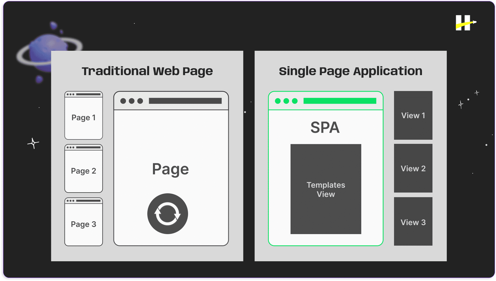
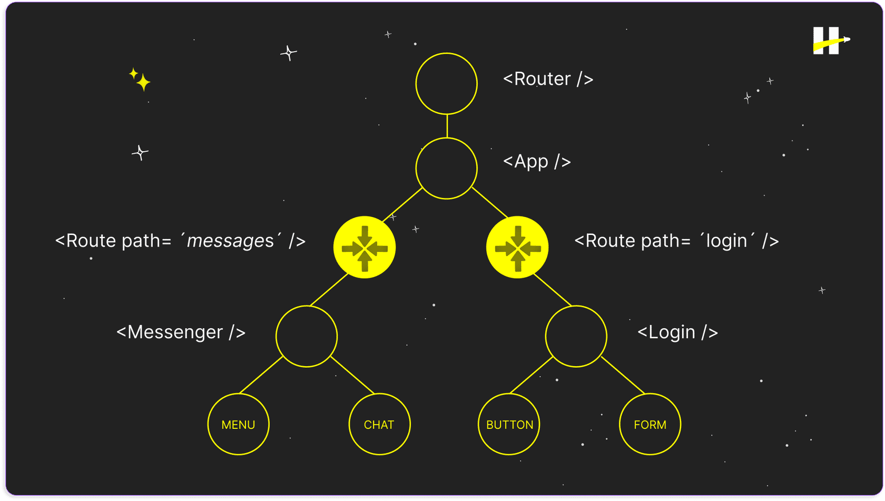
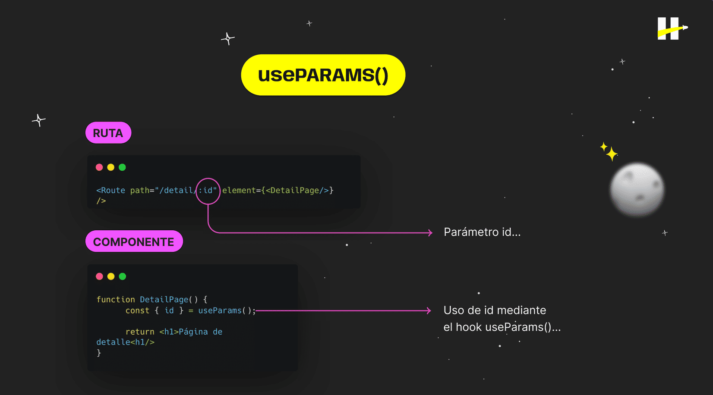
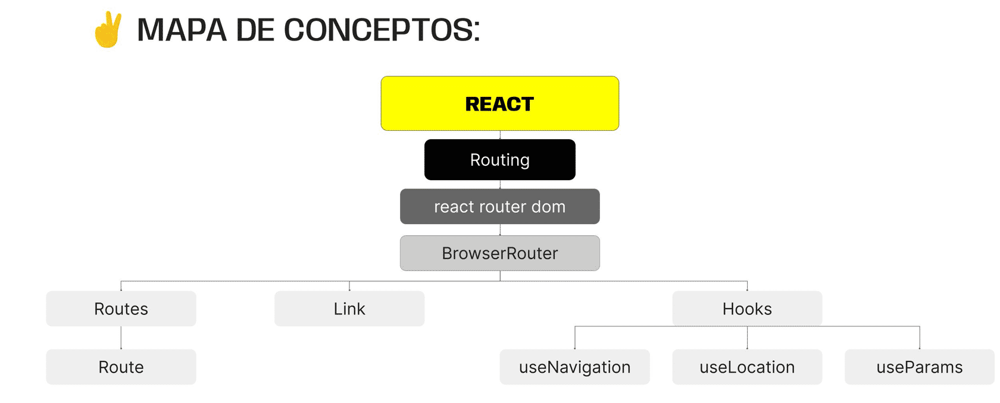

> # ***Modulo 3 - Clase 11: React Routing***

> ## ***Objetivos***

* ### *Aprender qué es routing.*

* ### *Conocer la librería de react router dom.*

* ### *Comprender cómo realizar la configuración inicial de react router dom.*

* ### *Entender cómo utilizar algunas de las funcionalidades de react router dom para generar una página dinámica.*

> ## ***Routing***

* ### **Enrutamiento**

  El routing es la gestión de las diferentes vistas de una página web, permitiendo que un usuario pueda navegar entre ellas. El usuario se podrá mover entre las diferentes vistas sin la necesidad de recargar la página por completo. De esta forma, definimos qué elementos serán renderizados en cada ruta.

  El término Single Page Application hace referencia a que, en el navegador, se carga solo una sola página HTML.

  Su contenido se actualizará de forma dinámica mientras el usuario interactúa con la aplicación. Por ende, en lugar de recargar la página una y otra vez cuando se hace un cambio, lo que hace es alternar la aparición de distintos elementos llamados Views o Pages, que se renderizan según la ruta en la que esté el usuario.

  

  De esta manera, denominaremos al cambio de vistas como routing. La navegación entre vistas es más fluida y rápida que la forma tradicional entre páginas.

* ### **[React router dom](https://reactrouter.com/en/main/start/overview)**

  Es una librería enfocada en el manejo de rutas para aplicaciones del lado del cliente. Esta herramienta gestiona el proceso de renderizado en una SPA, a partir de las rutas definidas para los diferentes componentes de nuestra aplicación.

  El enrutamiento puede ser representado, así como el DOM, como una especie de árbol. El componente App será el nodo root y los demás componentes junto a sus respectivas rutas, harán de nodos del árbol. Veremos esta analogía más adelante.

  

* ### **Instalación y configuración**

  ```bash
  npm install react-router-dom
  ```

  El proyecto en el que vamos a trabajar tiene diferentes archivos. Estos estarán agrupados en dos carpetas principales.

  1. Carpeta components: tendrá a todos aquellos componentes que se van a renderizar dentro de nuestra página web.

  2. Carpeta views: estarán todos los componentes que sean piezas estructurales de la aplicación, pero no son renderizados individualmente al cambiar de ruta. 

  * #### **[Starter Pack](https://drive.google.com/file/d/1EGUlUwFbvaQoDb60UuiEIU0zYXD1qkUX/view?usp=sharing)**

  Para iniciar lo configuración tendremos que dar acceso al "enrutador global"(BrowserRouter).

  Este es el componente de la librería que nos proveerá de las funcionalidades para crear un enrutado.

  Este debe ubicarse en el nivel más alto de nuestra aplicación. Dentro del archivo main.jsx envolviendo al componente App.

  ```javascript xml
  import React from "react";
  import ReactDOM from "react-dom/client";
  import { BrowserRouter } from "react-router-dom";
  import App from "./App.jsx";
  import "./index.css";

  ReactDOM.createRoot(document.getElementById("root")).render(
    <React.StrictMode>
      <BrowserRouter>
        <App />
      </BrowserRouter>
    </React.StrictMode>
  );
  ```

> ## ***Configuración***

* ### **Routes y Route**

  La librería nos proveerá de dos componentes muy importantes: Routes y Route. Estos se utilizan para definir las rutas de nuestra aplicación.

  ```javascript xml
  import { Routes, Route } from "react-router-dom";

  import HomePage from "./views/HomePage";
  import Navbar from "./components/NavBar";
  import LoginPage from "./views/LoginPage";
  import AboutPage from "./views/AboutPage";

  import "./App.css";

  function App() {
    return (
      <div className="App">
        <Navbar />
        <Routes>
          <Route path="/" element={<LoginPage />} />
          <Route path="/home" element={<HomePage contacts={contacts} />} />
          <Route path="/about" element={<AboutPage />} />
        </Routes>
      </div>
    );
  }

  export default App;
  ```

* ### **Rutas Dinámicas** 

  Las rutas dinámicas permiten configurar las direcciones web de manera que puedan incluir segmentos variables. Esto conlleva a que una misma ruta maneje diferentes valores en ciertas partes de la URL. 

  El utilizar parámetros en las rutas, posibilita la creación de componentes reutilizables, facilitando así  la construcción de aplicaciones más dinámicas y adaptables.

  ```javascript xml
  //App.jsx

  import HomePage from "./views/HomePage";
  import Navbar from "./components/NavBar";
  import LoginPage from "./views/LoginPage";
  import AboutPage from "./views/AboutPage";
  import DetailPage from "./views/DetailPage";

  import "./App.css";

  function App() {
    const [contacts, setContacts] = useState([]);

    useEffect(() => {
      fetch("https://jsonplaceholder.typicode.com/users")
        .then((response) => response.json())
        .then((data) => setContacts(data));
    }, []);

    return (
      <div className="App">
        <Navbar />
        <Routes>
          <Route path="/" element={<LoginPage />} />
          <Route path="/home" element={<HomePage contacts={contacts} />} />
          <Route path="/about" element={<AboutPage />} />
          <Route path="/detail/:id" element={<DetailPage />} />
        </Routes>
      </div>
    );
  }

  export default App;


  // Detail.jsx
  function DetailPage() {
    const [contact, setContact] = useState({});
    const { id } = useParams();

    useEffect(() => {
      fetch(`https://jsonplaceholder.typicode.com/users/${id}`)
        .then((response) => response.json())
        .then((data) => setContact(data))
        .catch((error) => console.error(error));

      return () => {
        setContact({});
      };
    }, [id]);

    return (
      <div>
        <h1>{contact.name}</h1>
        <p>{contact.email}</p>
        <p>{contact.phone}</p>
        <p>{contact.website}</p>
      </div>
    );
  }

  export default DetailPage;
  ```

  

> ## ***Redirección en eventos***

* ### **Nuevos hooks**

  ```javascript xml
  import { useNavigate, useLocation } from 'react-router-dom';

  const navigate = useNavigate();
  const location = useLocation(); // Este hook es un objeto que contiene informacion de la ruta actual del usuario.

  navigate("/home"); // Redirige al usuario a la ruta indicada por parametro.

  console.log(location); // {pathname: '/', search: '', hash: '', state: null, key: ''}
  
  ```

> ## ***Manejo de errores***

* ### **Componente Error**

  Existen diferentes tipos de errores y formas de manejarlos mediante el enrutamiento.

  ```javascript xml
  import { useState, useEffect } from "react";
  import { useNavigate } from "react-router-dom";

  function ErrorPage() {
    const navigate = useNavigate();
    const [countdown, setCountdown] = useState(5);

    useEffect(() => {
      const countdownInterval = setInterval(() => {
        setCountdown((prevCountdown) => prevCountdown - 1);
      }, 1000);

      setTimeout(() => {
        clearInterval(countdownInterval);
        navigate("/home");
      }, 5000);

      return () => clearInterval(countdownInterval);
    }, [navigate]);

    return (
      <div>
        <h1>Page Not Found</h1>
        <p>Redirecting to home in {countdown} seconds ...</p>
      </div>
    );
  }

  export default ErrorPage;
  ```

  Este componente muestra una cuenta regresiva al montarse, usando un estado local llamado countdown (inicializado en 5). 

  Se actualiza cada segundo mediante setInterval y se reinicia al montar el componente para sincronizar con setTimeout, que llevará al usuario a "/home" después de 5 segundos.

  Al desmontarse el componente, reiniciamos el intervalo para mantener la precisión al volver a ingresar.

  ```javascript xml
  return (
    <div className="App">
      {location.pathname === "/" ? null : <Navbar />}
    
      <Routes>
        <Route path="/" element={<LoginPage />} />
        <Route path="/home" element={<HomePage contacts={contacts} />} />
        <Route path="/about" element={<AboutPage />} />
        <Route path="/detail/:id" element={<DetailPage />} />
        <Route path="*" element={<ErrorPage />} />
      </Routes>
    </div>
  );
  ```

  Para mostrar este componente en cualquier ruta que no sea la existente tendremos que definirlo.

  El path de esta ruta es "*", lo que significa que el componente se renderizará si no se ha accedido a ninguna de las rutas definidas anteriormente.
***

> ## ***Cierre***

* ### **En conclusión...**

  * ***Abordamos el concepto de Routing:*** Conocimos la librería react-router-dom  que facilita la navegación y el enrutamiento. Aprendimos sus componentes principales, como el BrowserRouter, Route, Routes y Link.

  * ***Descubrimos que el Enrutamiento:*** Puede estar sujeto a distintos parámetros que permiten visualizar diferente contenido mediante el uso del hook useParams. También vimos que la combinación de useLocation, y useNavigate añade flexibilidad y dinamismo a nuestras rutas, permitiendo renderizar condicionalmente dentro de cada ruta, así como la redirección.

  
***