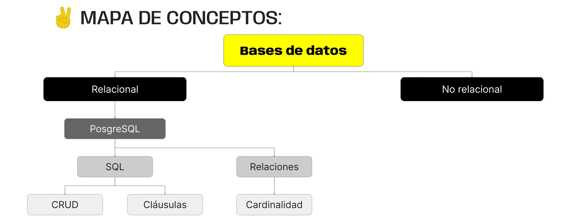

> # ***Modulo 3 - Clase 4: SQL Fundamentals***

> ## ***Objetivos***

* ### *Aprender qué son las base de datos relacionales.*

* ### *Realizar la configuración inicial de PostgreSQL.*

* ### *Conocer los fundamentos de SQL.*

* ### *Realizar las operaciones básicas de consulta, creación, eliminación y actualización de datos mediante SQL.*

* ### *Entender el modelado de solicitudes mediante cláusulas y operadores de SQL.*

> ## ***Bases de datos relacionales***

* ### **Relacional**

  Las bases de datos relaciones cumplen la misma función que las no relacionales, pero su principal diferencia es que la información se almacena en estructuras tabulares (tablas) compuestas por filas y columnas, en lugar de colecciones y documentos.

* ### **Consideremos dos escenarios concretos para ilustrar mejor esta diferencia.**

  * #### **Sistema de gestión de pedidos en un comercio electrónico.**

    En este tendremos tablas que representan usuarios, productos y pedidos. 

    * ***Usuarios***

        |Nombre|Email|Contraseña|
        |:-:|:-:|:-:|
        |Game|gama@mail.com|123ert$%&234|
        |Alejo|alejo@mail.com|456vxcb&/(r345|

    * ***Productos***

        |Código|Nombre|
        |:-:|:-:|
        |123|Computadora|
        |124|Monitor 8K|
        |125|Parlantes|

    * ***Pedidos***

        |Usuario|Productos|Fechas|
        |:-:|:-:|:-:|
        |Gama|Computadora|2024-01-02|
        |Alejo|Monitor 8K|2023-10-21|

    #### Como podemos ver, las tablas en una base de datos relacional mantienen una estructura estática para la información que guardan en ellas. 

    #### Cada usuario tiene las mismas características, así como los productos y pedidos. 

  * #### **Plataforma de Redes Sociales**

    ```json
    {
      "nombre_usuario": "pepito_messi123",
      "biografia": "Soy un ingeniero de software de Colombia ...",
      "publicaciones": [],
      "seguidores": 15,
      "seguidos": 452
    }
    ```

    #### Los perfiles basados en una base de datos no relacional, no tienen esta condición. 

    #### Por su parte, poseen un esquema flexible y pueden contener diferentes datos según las necesidades del proyecto.

    ```json
    {
      "nombre_usuario": "max234_cfr",
      "biografia": "Entrepreneur | Architect",
      "publicaciones": [
        { "id": 1, "post": "Greetings from USA!" },
        { "id": 2, "post": "Paris tonight" }
      ],
      "seguidores": 15345,
      "seguidos": 23452,
      "fotos": ["foto1.jpg", "foto2.jpg", "foto3.jpg"],
      "videos": ["video1.jpg"],
      "etiquetas": ["food", "vacations", "travel"]
    }
    ```

En el modelo relacional, una entidad se representa como una tabla que encapsula las características de un objeto, como el usuario del ejemplo anterior.

Cada columna de la tabla representa los atributos o propiedades de esa entidad y las filas contienen los registros o instancias particulares de esa entidad (cada usuario individual).

Para mantener esta integridad se especifica la cardinalidad entre tablas relacionadas. La cardinalidad nos indica cuántos registros de una tabla están asociados con cuántos de otra.

Existen tres tipos posibles de cardinalidad dentro del modelo relacional...

* ### **UNO A UNO (1:1)**

  Cada fila en una tabla está relacionada a lo sumo con una fila en la otra tabla, y viceversa.

  Podemos definir, por ejemplo, que una entidad Persona se relacione con una entidad Area (nos referimos al "área" de una empresa), bajo la relación “dirigir”.

  En palabras simples, diremos que “una persona dirige una sola área y, a su vez, un área es dirigido por una sola persona”.

  

* ### **UNO A MUCHOS (1:N)**

  Cada fila en la tabla "A" puede estar relacionada con varias filas en la tabla "B", pero cada fila en la tabla "B" solo puede estar relacionada con una fila en la tabla "A".

  Continuando con el ejemplo anterior, diremos que, bajo la relación “trabajar”, podemos considerar que “muchas personas trabajan en una sola área y, de la misma manera, en una sola área trabajan muchas personas”.

  

* ### **MUCHOS A MUCHOS (N:M)**

  Varias filas en una tabla pueden estar relacionadas con varias filas en la otra tabla.

  Para este caso y considerando dos entidades, Actor y Película, bajo la relación “actuar”, es pertinente decir que “cada actor puede actuar en muchas películas y, de forma análoga, en cada película actúan muchos actores”.

  

* ### **¿Qué es SQL?**

  SQL (Structured Query Language) es un lenguaje estandarizado que permite realizar queries de información a una base de datos relacional. Estas queries pueden ser consultas, actualizaciones, inserciones o eliminación de datos. Es un lenguaje declarativo, es decir, el usuario indica qué operación y qué resultado desea obtener y el sistema de gestión se encarga del procesamiento de la solicitud.

> ## ***PostgreSQL***

* ### **¿Qué es?**

  PostgreSQL es una base de datos de código abierto y de alto rendimiento. Es hasta la fecha el sistema de gestión más utilizado en la industria. Cuenta con soporte completo para las consultas SQL e incorpora una amplia gama de tipos de datos propios y personalizados que facilitan la gestión de la información.

  En tu terminal shell para crear tu base de datos...

  ```shell
  CREATE DATABASE <nombre de la BD>;
  ```

  Todos los comandos que escribas dentro de la terminal deben terminar en punto y coma (;) para que sean ejecutados correctamente.

  Para poder visualizar nuestras bases de datos dentro de PostgreSQL debemos ejecutar el comando...

  ```shell
  \l
  ```

  

  Para conectarnos a una base de datos y trabajar sobre ella debemos utilizar el comando...

  ```shell
  \c
  ```
  
  especificando el nombre de la BD.

  

> ## ***Creación de tablas y constraints***

* ### **Create Table**

  Ya que estamos conectados a nuestra base de datos, utiliza el comando...

  ```shell
  CREATE TABLE <nombre de la tabla>(propiedades);
  ```

  en el que las propiedades indican las características que tendrá cada columna de la tabla.

* ### **Constraints y [Tipos de Datos](https://www.postgresql.org/docs/current/datatype.html)**

  Las propiedades (columnas) de cada entidad deben tener asociado un tipo de dato que nos permite asegurar que la información de todas las instancias o registros de dicha tabla sea estandarizada, limitando la información que puede ser almacenada en ella. Algunos de estos tipos de datos son:

  * **Character varying - varchar(n):** Para strings que contengan entre 1 y n caracteres.

  * **Integer - int:** Integers de 4 bytes, es decir, un número tan grande como 2 a la potencia 32.

  * **Date:** Fechas de calendario con estructura año, mes, dia.

> ## ***Estructura de una query***

* ### **Interacción con las tablas**

  Cuando hablamos de trabajar con tablas nos referimos a trabajar con información; añadirla, modificarla, eliminarla, etc. Para lograr este tipo de interacciones utilizaremos las querys que nos permite crear SQL.

  * #### **INSERT INTO**
    
    Inserta una nueva fila en una base de datos.

    ```shell
    INSERT INTO peliculas (title, year, duration)
    VALUES ('Titanic', 1997, 195);
    ```

  * #### **SELECT * FROM**
    
    Retorna todos los registros en una base de datos.

    ```shell
    SELECT * FROM peliculas;
    ```

  * #### **SELECT "propiedad/es" FROM**

    Retorna solo la/s propiedad/es especificada/s de todos los registros de una base de datos.

    ```shell
    SELECT title FROM peliculas;
    SELECT year, duration FROM peliculas;
    ```

  * #### **WHERE**

    Especifica una condicion que deben cumplir los registros seleccionados.

    ```shell
    SELECT * FROM peliculas WHERE year = 1994;
    ```

  * #### **ORDER BY**

    Ordena segun la condición especificada.

    ```shell
    SELECT * FROM peliculas ORDER BY duration;
    ```

  * #### **COMBINACIONES**

    Estas querys pueden ser combinadas.

    ```shell
    SELECT * FROM peliculas WHERE year = 1994 ORDER BY duration;
    ```

  * #### **UPDATE**

    Actualiza una o varias propiedades de un registro.

    ```shell
    UPDATE peliculas SET year = 1994 WHERE id = 6;
    ```

  * #### **DELETE**

    Elimina un registro de la tabla.

    ```shell
    DELETE FROM peliculas WHERE id = 3;
    ```

  * #### **ALTER TABLE "base de datos"**
    #### **ADD COLUMN;**

    Altera la base de datos y añade una columna.
    
    ```shell
    ALTER TABLE peliculas
    ADD COLUMN director_id INTEGER;
    ```

  * #### **ALTER TABLE "base de datos"**
    #### **ADD CONSTRAINT;**

    Añade la restriccion de la nueva columna.
    
    ```shell
    ALTER TABLE peliculas
    ADD CONSTRAINT fk_director
    ```

  * #### **FOREIGN KEY ("nombre de la nueva columna")** 

    Añade el nombre a la nueva columna.

    ```shell
    FOREIGN KEY (director_id)
    ```

  * #### **REFERENCES "tabla"("propiedad a referenciar")**

    Conecta la nueva columna con la propiedad de otra tabla.

    ```shell
    REFERENCES directores(id);
    ```

  * #### **SELECT "alias.propiedad" AS "nuevoNombre en la tabla", "alias.propiedad" AS "nuevoNombre en la tabla"**
    #### **FROM "base de datos" "alias"**
    #### **JOIN "base de datos foranea" "aliasForaneo" ON "alias.propiedad" = "aliasForaneo.propiedadForanea"**

    Crea una tabla de union entre dos tablas.

    ```shell
    SELECT p.title AS pelicula, d.name AS director
    FROM peliculas p
    JOIN directores d ON p.director_id = d.id; 
    ```  

> ## ***Relaciones en SQL***

* ### **Join**

  Cuando realizamos solicitudes lo más común es que esa solicitud dependa de la información de dos o más tablas en función de la relación entre ellas. Para poder crear estas querys, SQL nos permite utilizar la cláusula llamada JOIN para unir la información entre tablas.

  Por ejemplo, si al realizar una solicitud en vez de visualizar las claves foráneas de cada tabla deseamos conocer el valor que representa, debemos definir el punto de unión entre ambas tablas.

* ### **SQL JOINS**

  

    * **FULL OUTER JOIN:** Devuelve todas las filas cuando hay una coincidencia en una de las tablas. Si no hay una coincidencia, devuelve NULL para las columnas de la tabla sin coincidencias.

    * **INNER JOIN:** Devuelve filas cuando hay una coincidencia en las tablas de ambos lados de la cláusula JOIN. Es decir, solo devuelve filas donde las columnas que participan en la condición de unión tienen valores que se encuentran en ambas tablas.

    * **RIGHT JOIN:** Devuelve todas las filas de la tabla de la derecha (B) y las filas correspondientes de la tabla de la izquierda (A) cuando hay una coincidencia. Si no hay una coincidencia, devuelve NULL para las columnas de la tabla de la izquierda.

    * **LEFT JOIN:** Devuelve todas las filas de la tabla de la izquierda (A) y las filas correspondientes de la tabla de la derecha (B) cuando hay una coincidencia. Si no hay una coincidencia, devuelve NULL para las columnas de la tabla de la derecha.

> ## ***Filtrado y ordenamiento de datos***

* ### **Operadores de comparación**

  SQL integra también herramientas para filtrar y comparar datos de nuestras consultas a partir de operadores. Estos pueden ser utilizados para buscar registros con características muy particulares respecto a sus valores.

  Para crear las querys que nos permiten realizar estas solicitudes tenemos mútiples herramientas que nos ayudan a definir condiciones de filtro u ordenamiento. Una de ellas son los operadores de comparación. Estos operadores nos permiten utilizar cláusulas como WHERE o JOIN para comparar dos valores y devolver un resultado booleano que nos permitirá filtrar la información.

  Algunos de estos operadores son....

  * **Igual a (=)**
  
  * **Diferente de (!=)**

  * **Mayor que (>)**

    

  * **Menor que (<)**

    

  * **Mayor o igual que (>=)**

  * **Menor o igual que (<=)**

* ### **Operadores lógicos**

  Estos operadores permiten combinar/modificar condiciones en las querys con cláusulas como WHERE, y sirven para realizar comparaciones lógicas entre expresiones.

  * **AND**
  
  * **OR**
   
    

  * **NOT**

    
***

> ## ***Cierre***

* ### En conclusión...

  * ***Vimos los fundamentos de las relaciones en una base de datos y de SQL:*** Así como sus principales características y uso. Comparamos el paradigma SQL vs NoSQL para resaltar las razones por las cuales es importante conocer y trabajar también con bases de datos relacionales.

  * ***Exploramos cómo organizar, manipular y consultar datos utilizando PostgreSQL:*** Como base de datos. Diseñamos esquemas, creamos tablas que representan entidades y se relacionan unas con otras, conocimos las distintas cardinalidades entre dichas relaciones y a ejecutar consultas complejas utilizando distintas cláusulas, así como operadores lógicos y de comparación.

  * ***Tuvimos un vistazo general de los Joins:*** Que permiten crear queries más complejas y obtener información explícita entre las tablas que se relacionan.

  
***