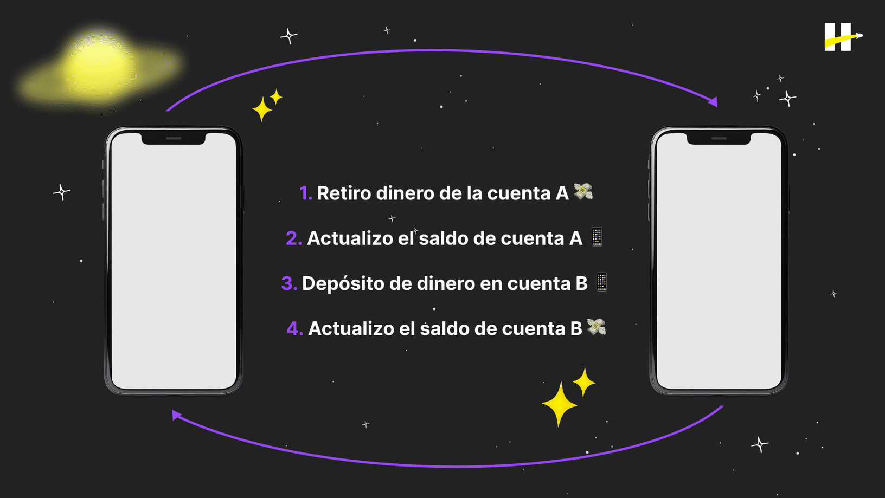
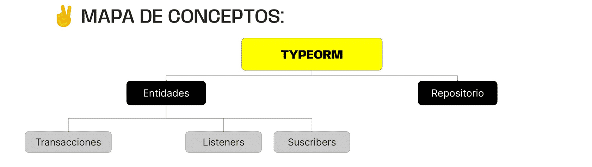

> # ***Modulo 3 - Clase 6: TypeORM II***

> ## ***Objetivos***

* ### *Conocer qué son y cómo se manejan las transacciones.*

* ### *Entender cómo utilizar un Repositorio en TypeORM.*

* ### *Aprender qué son y cómo funcionan los listeners y subscribers.*

> ## ***Transacciones***

* ### **¿Qué es?**

  Las transacciones son secuencias de operaciones que se ejecutan como una unidad lógica y atómica. Esto quiere decir que todas las operaciones deben ser ejecutadas con éxito para que el resto se lleven a cabo.

  Supongamos que debemos realizar una transferencia bancaria de la cuenta A a la B. Los pasos serían los siguientes.

  

  Pero, ¿Qué ocurriría si la cuenta A no tiene saldo suficiente o si el número de la cuenta B no existe? En cualquiera de los casos la transacción tendría que detenerse. Pues bien, las transacciones en las bases de datos funcionan de esta forma.

* ### **Argumentos del método transaction()**

  * #### **Nivel de aislamiento**
   
    El primero será un nivel de aislamiento que determina qué tan estrictas son las operaciones realizadas por esta transacción y si otras transacciones pueden acceder a sus datos, siendo READ UNCOMMITED la de menor aislamiento y la de mayor nivel.

    Mientras más alto sea este nivel, más confiable será la transacción, pero también más costoso el proceso en términos de rendimiento.

  * #### **Función asíncrona**

    Como segundo argumento recibirá una función asíncrona que se encargará de realizar las consultas a la DB y recibe como argumento a transactionalEntityManager que resolverá la promesa ya sea en caso de éxito o rechazo.

    Esta posee un método llamado createQueryBuilder() el cual, a su vez, cuenta con diferentes métodos para formar querys de SQL a partir de funciones y sus argumentos.

* ### **Inicio y confirmación de una transacción**

  Al realizar una transacción de forma exitosa, esta se confirma por medio de COMMIT indicando que se ha finalizado con éxito el registro y continúa con el resto de las transacciones.

* ### **Rollback y manejo de errores**

  #### **Una transacción puede no completarse debido a situaciones como:**

  * Violación a las restricciones de la base de datos (clave primaria duplicada, registro repetido, campos obligatorios vacios, etc).

  * El servidor deja de escuchar en un puerto específico por errores de red.

  * Excepciones en la lógica del código.

  Es por esto que necesitamos mecanismos llamados rollback que permitan manejar errores y revertir los cambios que se realicen a un estado previo si la transacción no se completa con éxito.

  Al fallar una transacción los cambios no son confirmados y en lugar de ejecutarse el COMMIT, se ejecuta un ROLLBACK, que revertirá todos los cambios previamente definidos en el inicio de la transacción para que el resto de estas que están en cola, puedan tomar la información correcta de la base de datos.

  Al presentarse un error el servidor se “cae” y es necesario reiniciarlo para poder continuar.

  En la práctica el servidor debe seguir realizando sus funciones independientemente de una solicitud errónea. Debe reportar también al cliente el error obtenido de la petición.

  Cuando trabajamos con controladores asincrónicos, debemos envolver nuestro código en los bloques try/catch para gestionar la resolución de la promesa creada por la solicitud. Esto nos permitirá devolver una respuesta al cliente ya sea en caso de éxito o rechazo.

> ## ***Manejo de repositorios***

* ### **Repositorios vs EntityManager**

  A grandes rasgos, un repositorio tiene la misma función que manager. Sin embargo, un repositorio limita su acción a una entidad en concreto y no sobre la colección general que las contiene.

  Lo primero que debemos hacer es generar un repositorio para cada entidad mediante el método getRepository() de AppDataSource.

  Este método recibe como argumento la entidad a la cual queremos acceder y la asocia al repositorio que creamos como una constante.

  ```typescript
  const videogameRepository = AppDataSource.getRepository(Videogame);
  ```

* ### **Repositorios personalizados**

  El manejar un repositorio que sea exclusivo de una entidad nos permite agregar métodos que únicamente sean aplicables a este repositorio y que desempeñen una tarea particular dentro de él.

  En lugar de repetir una y otra vez la lógica de búsqueda, podríamos agregar esta funcionalidad a usersRepository y utilizarla desde allí.
***

> ## ***Cierre***

* ### **En conclusión...**

  * ***Comprendimos la importancia de los Repositorios:*** Como interfaces para interactuar con nuestras entidades directamente, permitiendo así una separación clara entre la lógica personalizada de cada entidad y el manejo de los controladores.

  * ***Aprendimos cómo utilizar Transacciones:*** para garantizar la consistencia de nuestros datos al realizar operaciones complejas que requieren múltiples cambios, así como a manejar los distintos errores que puedan ocurrir a lo largo del proceso.

  * ***Exploramos los conceptos de Listeners y Subscribers:*** Que nos permiten capturar y responder a eventos específicos que ocurran al trabajar con nuestras entidades y la conexión a la base de datos, añadiendo flexibilidad y extensibilidad a nuestras aplicaciones.

  
***