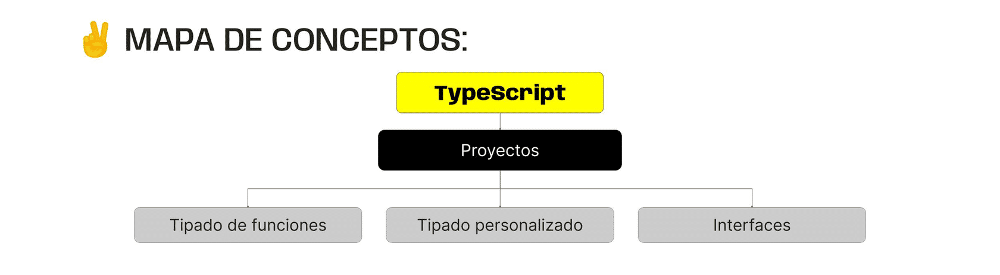

> # ***Modulo 3 - Clase 2: TypeScript II***

> ## ***Objetivos***

* ### *Comprender y aplicar el concepto de funciones y tipado en TypeScript.*

* ### *Dominar la técnica de emplear parámetros tipados en funciones para mejorar la integridad del código.*

* ### *Utilizar tipos de retorno en funciones para asegurar la consistencia en el manejo de datos.*

* ### *Explorar el uso de interfaces y tipos personalizados.*

> ## ***Funciones y tipado***

* **¿Cómo tipar funciones?**

  ```typescript
  const saludar = (name: string): string => {
    return `Hola ${name}`;
    return 5; // Type Error
  };

  console.log("Pedro") // "Hola Pedro"
  console.log(5) // Type Error

  const saludar2 = (name: string): void => {
    console.log(`Hola ${name}!`);
    return `Hola ${name}!` // Type Error
  }

  const calcularTotal = (quantity: number, price: number): number => {
    return quantity * price;
    return `La cantidad es ${quantity * price}`; // Type Error 
  }
  
  console.log(calcularTotal(5, 10));
  console.log(calcularTotal(5, "holis")); // Type Error
  ```

> ## ***Interfaces y tipos personalizados***

* ### **¿Qué es?**

  Las interfaces permiten definir la forma que debe tener los tipos de datos más complejos. En el caso de los objetos, especifican qué propiedades deben contener, así como los tipos de datos asociados a sus valores.

  Estas no proporcionan una implementación real. Solo establece las reglas que deben seguir. Una interfaz sería una especie de plantilla que define cómo deben ser los bloques de cada tipo.

  ```typescript
  interface IBloqueGeneral {
    lado: number;
    alto: number;
    color: string;
    tamaño: number;
  }
  ```

* ### **Definición de tipos personalizados**

  Los tipos (types), similares a las interfaces, proporcionan reglas que nos permiten definir tipos de datos como objetos, arrays, funciones, etc.

  ```typescript
  interface IAddress {
    street: string;
    city: string;
  }

  enum UserRole {
    ADMIN = "Admin",
    USER = "User",
    GUEST = "Guest"
  }

  type TUser = {
    name: string,
    age: number,
    email: string,
    active: boolean,
    address: IAddress,
    role: UserRole
  }
  ```

* ### **Interfaces | Casos de uso**

  Tanto las interfaces como los types permiten ser extendidos por otras interfaces o types. Esto quiere decir que pueden heredar información para usarla en sus propias estructuras. Sin embargo, lo más común es utilizar interfaces, debido a su legibilidad y mejor visualización de errores en compilación.

  ```typescript
  interface ITrabajo {
    compania: string;
    posicion: string;
  }

  interface IEmpleado extends ITrabajo {
    nombre: string;
    edad: number;
  }

  const empleado: IEmpleado = {
    compania: "Google",
    posicion: "Senior Engineer",
    nombre: "Pedro Perez",
    edad: 35
  };  
  ```

  Otra característica particular es que cuando creamos dos interfaces con el mismo nombre en distintas partes del código, ambas se comportan como una sola con toda la información.

  ```typescript
  interface IMascota: { nombre: string }
  interface IMascota: { edad: number }

  const miPerro: IMascota = {
    nombre: "Beethoven",
    edad: 2
  }
  ```

* ### **Tipos | Casos de uso**

  * #### **Union Types**

    Estos permiten describir valores que pueden ser uno de varios tipos posibles, ya sean primitivos o complejos.

    Para indicar que este será un nuevo tipo de dato debemos inicializarlo con el indicador type.

    Al utilizar unión types se proporciona una forma clara y segura de manejar casos en los que una variable puede tener distintos valores.

    ```typescript
    type tallaCamisa = "S" | "M" | "L" | "XL";

    function validarTalla(talla: tallaCamisa): string {
      if (talla == "XL" || talla == "S") {
        return "Agotado";
      }
      return "Disponible";
    }

    console.log(validarTalla("L")); // "Disponible"
    console.log(validarTalla("S")); // "Agotado"
    ```

  * #### **Alias**

    Los alias de tipos son una característica en TypeScript que permiten asignar un nombre personalizado a un tipo existente o complejo. Esto facilita la creación de tipos reutilizables.

    ```typescript
    type Coordenada = [number, number];

    function imprimirCoordenada(coordenada: Coordenada) {
      console.log(`Latitud: ${coordenada[0]}, Longitud: ${coordenada[1]}`);
    }

    // Uso del alias de tipo
    const ubicacion: Coordenada = [40.7128, -74.0060];
    imprimirCoordenada(ubicacion); // "Latitud: 40.7128, Longitud: -74.006"
    ```
***

> ## ***Cierre***

* ### **En conclusión...**

  * ***Conocimos el Tipado de Funciones en Interfaces y el Tipado Personalizado:*** Comprendimos cómo tipificar funciones, tanto sus parámetros como el valor que retornan, a partir de tipos de datos primitivos y complejos. Si nuestras funciones no retornan valores, TypeScript podrá inferirlo sin necesidad de escribirlo manualmente.

  * ***Exploramos la creación y uso de Interfaces y Tipos:*** Para estructurar objetos. Vimos que, a pesar de que su comportamiento fuera similar, tenían casos de uso puntuales que los diferenciaba uno del otro, haciendo énfasis en la herencia, los unión types y los alias.

  