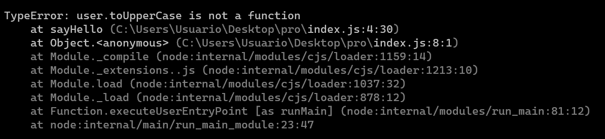
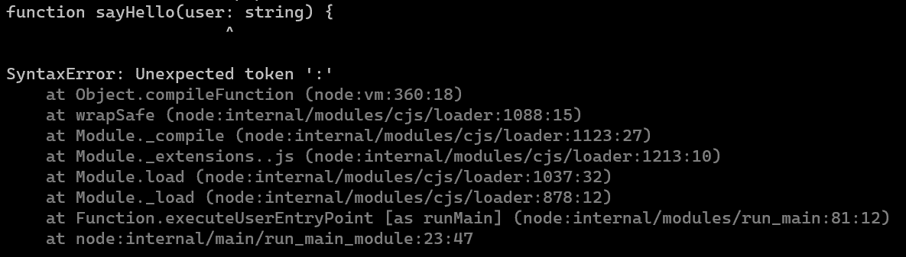
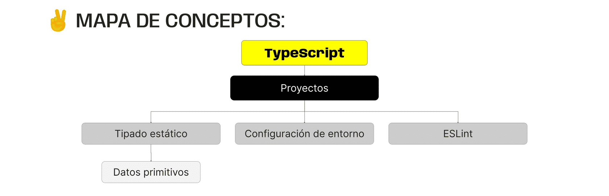

> # ***Modulo 3 - Clase 1: TypeScript***

> ## ***Objetivos***

* ### *Comprender los conceptos básicos de TypeScript.*

* ### *Conocer cómo generar un entorno de desarrollo en TypeScript.*

* ### *Familiarizarse con la sintaxis básica de TypeScript.*

* ### *Entender la tipificación estática y sus beneficios.*

> ## ***TypeScript***

* ### **¿Qué es?**

  TypeScript es un lenguaje de programación de código abierto fuertemente tipado que actúa como una extensión de JavaScript.

* ### **¿Fuertemente tipado?**

  Recordemos que dentro de las características básicas de JavaScript, se menciona que es un lenguaje de programación "débilmente tipado". Esto significa que las variables declaradas en JavaScript pueden cambiar de tipo de dato durante la ejecución de un programa.

  ```javascript
  let x = 10;

  x = "Ahora serás un string";

  console.log(typeof x); // string
  ```

  En TypeScript esto no sería posible ya que el tipo de dato es estático, lo que significa que está asociado a la variable en el momento de su creación y no permite que sea modificado nunca más, y el tratar de modificarlo conllevará a un error.

  ```typescript
  let x: number = 10;

  x = "Ahora serás un string"; // Type 'string' is not assignable to type 'number'
  ```

* ### **¿Por qué utilizar Typescript?**

  TypeScript nos da las mismas funcionalidades de JavaScript, pero con una capa extra de seguridad gracias a su sistema de tipado. Esto quiere decir que podemos trabajar código tal como lo haríamos con JavaScript, pero con la ventaja de que podemos supervisar la consistencia en los tipos de datos utilizados para prevenir comportamientos inesperados en el código o bugs.

  Consideremos que dentro de un archivo existe una función que utiliza como argumento un string para imprimir algo en consola. Al trabajar con JavaScript estamos asumiendo que efectivamente ese argumento recibido será siempre un string.

  ```javascript
  const usuario = "Gamaliel";

  function sayHello(user) {
    console.log(`Hello ${user.toUpperCase()}`);
  }

  sayHello(usuario);
  sayHello(1);
  sayHello(true);
  sayHello(["no", "funca"]);
  ```

  En el mejor escenario esto va a funcionar sin problemas pero, ¿qué ocurre si en lugar de recibir un string la función recibe un número, un array o un objeto?

  

  En efecto, obtenemos un error dado que el método toUpperCase solo está definido para strings.

  TypeScript hace una verificación en tiempo de compilación, ayudándonos a detectar errores mientras escribimos el código y no al ejecutarlo.

  Continuando con el ejemplo anterior, cambiaremos la extensión del archivo de index.js a index.ts, y luego vamos a agregarle a la variable user el tipado (user: string). Al hacer esto nos daremos cuenta que inmediatamente podemos ver los errores en la función sayHello() con los distintos argumentos.

  ```javascript
  const usuario = "Gamaliel";

  function sayHello(user: string) {
    console.log(`Hello ${user.toUpperCase()}`);
  }

  sayHello(usuario);
  sayHello(1); // argument of type 'number' is not assignable to parameter of type 'string'
  sayHello(true); // argument of type 'boolean' is not assignable to parameter of type 'string'
  sayHello(["no", "funca"]); // argument of type 'string[]' is not assignable to parameter of type 'string'
  ```

  Además de brindarnos información sobre los errores de forma rápida, TypeScript incluye una herramienta nativa de autocompletado de funciones en el editor de texto, lo que lo vuelve más preciso dando opciones compatibles con el tipo de dato asociado.

  Es necesario hacer la observación de que los entornos de ejecución como node o los navegadores web no tienen ni idea de qué es TypeScript ni su sintaxis para tipar estáticamente, pues solo trabajan con JavaScript. Si intentamos ejecutar el archivo index.ts con node recibiremos errores...

  

  Para poder ejecutar este script es necesario que sea previamente transpilado (traducido) a JavaScript.

> ## ***Configuración de entorno***

* ### **Configuración inicial de entorno**

  Para poder utilizar TypeScript es necesario instalarlo dentro de nuestro proyecto o de forma global en nuestra computadora.

  ```bash
  npm install -g typescript # Instala TypeScript de forma global en tu computadora y te permite utilizarlo en cualquier proyecto.
  
  npm install --save-dev typescript ts-node # Crea automáticamente un proyecto local de node con todas las dependencias de TypeScript instaladas.

  npx tsc index.ts # Compila el código TS a JS
  ```

* ### **ESLint**

  ESLint es una herramienta para análisis de código de JavaScript, puede ser implementada con TypeScript mediante la adición de algunos plugins con características específicas. Para incorporarlo a nuestro proyecto, es necesario instalar dependencias que serán utilizadas durante el proceso de desarrollo.

  ```bash
  npm install eslint @typescript-eslint/parser @typescript-eslint/eslint-plugin prettier --save-dev
  ```

  En primera instancia, hay que crear un archivo de configuración llamado .eslintrc.js dentro del cual configuraremos los plugins necesarios.

  ```javascript
  // eslintrc.js

  module.exports = {
    parser: "@typescript-eslint/parser",
    plugins: ["@typescript-eslint"],
    extends: ["eslint:recommended", "plugin:@typescript-eslint/recommended"],
    rules: {
    // Puedes añadir reglas personalizadas aquí
    },
  };
  ```
  
  Por último, solo tendrás que asignar en el package.json un nuevo script llamado lint

  ```json
  "lint": "eslint . --ext .ts"
  ```

> ## ***Tipos de datos***

* ### **Tipos de datos básicos**

  El tipado para las variables que contienen estos datos, no necesariamente deben definirse de forma manual, puesto que este lenguaje puede inferir el tipo de forma automática.
***

> ## ***Cierre***

* ### **En conclusión...**

  * ***Aprendimos un nuevo lenguaje, TypeScript:*** Vimos cuáles son las ventajas de hacer código utilizando el tipado estático y cómo configurar nuestro entorno de desarrollo para que nuestros proyectos puedan ser más seguros.

  * ***Descubrimos que TypeScript provee una especie de "Asistente de Desarrollo":*** que está al tanto de nuestros posibles errores al momento de escribir código, compilando nuestros scripts con extensión .ts en archivos .js tradicionales.

  * ***Conocimos de qué manera hacer uso de los tipos de Datos Primitivos:***, así como a determinar en qué situaciones es beneficioso realizar el tipado estático manualmente y cuándo dejar que este sea inferido.

  
***